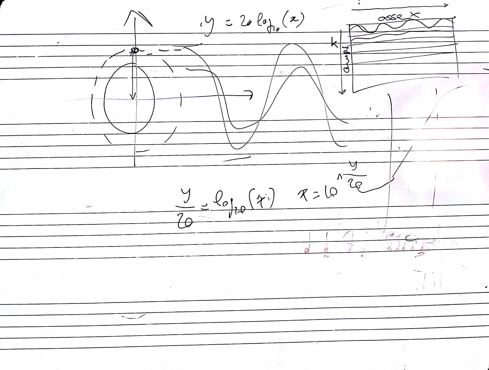

# CSEDSM 1 - Lezione del 23 gennaio 2018

## Argomenti

### Parametri dei fenomeni periodici discreti:

* ampiezza: lineare vs dB
* frequenza: campionamento, foldover, aliasing



## Codice

[`20180123_01.m`](./20180123_01.m):

```matlab
%Sinusoidi con rappresentazione in ampiezze lineari.

fcamp = 1000;                           %espressa in Hz.
pcamp = 1/fcamp;
dur = 300*pcamp;                        %durata in campioni.
asse_x = [-dur/2:pcamp:(dur/2)-pcamp];  %simmetrico rispetto allo 0. 
amps = [1 1/2 1/3 1/4 1/5 1/6 1/7 1/8]; %vettore delle ampiezze.
dbamps = 20*log10(amps);                %vettore delle ampiezze in db.

f = 30;                                 %espressa in Hz.
w = 2*pi*f;

ys = zeros(size(amps,2), size(asse_x,2)); %riempio di 0 la matrice ys.
ysdb = zeros(size(ys));

for (k=1 : size(amps,2))
  ys(k,:) = amps(k)*cos(w*asse_x);      %riempio tutte le colonne della k-esima 
  ysdb (k,:) = dbamps(k)*cos(w*asse_x);
end                                     %riga.

subplot(2,1,1);                         %per inserire due grafici nello stesso 
plot (asse_x, ys);                      %plot.
subplot(2,1,2);
plot (asse_x, ysdb);
```

[`20180123_02.m`](./20180123_02.m):

```matlab
%Sinusoidi con rappresentazione in ampiezze lineari GIUSTO.

fcamp = 1000;                           %espressa in Hz.
pcamp = 1/fcamp;
dur = 300*pcamp;                        %durata in campioni.
asse_x = [-dur/2:pcamp:(dur/2)-pcamp];  %simmetrico rispetto allo 0. 
amps = [1 1/2 1/3 1/4 1/5 1/6 1/7 1/8]; %vettore delle ampiezze.
dbamps = [0:-6:-60];                    %vettore delle ampiezze in db.

f = 30;                                 %espressa in Hz.
w = 2*pi*f;

ys = zeros(size(amps,2), size(asse_x,2)); %riempio di 0 la matrice ys.
ysdb = zeros(size(ys));

for (k=1 : size(amps,2))
  ys(k,:) = amps(k)*cos(w*asse_x);      %riempio tutte le colonne della k-esima 
  ysdb (k,:) = (10.^(dbamps(k)/20))*cos(w*asse_x); %riga.
end                                     

subplot(2,1,1);                         %per inserire due grafici nello stesso 
plot (asse_x, ys);                      %plot.
subplot(2,1,2);
plot (asse_x, ysdb);
```

[`20180123_03.m`](./20180123_03.m):

```matlab
%Sinusoidi con rappresentazione in frequenza...

fcamp = 1000;                           %espressa in Hz.
pcamp = 1/fcamp;
dur = fcamp*pcamp;                        %durata in campioni.
asse_x = [-dur/2:pcamp:(dur/2)-pcamp];  %simmetrico rispetto allo 0. 
amps = 1; %vettore delle ampiezze.
f = [30 100 1001 500 600];                      %con f=1001 -> foldover           %espressa in Hz.

ys = zeros(size(amps,2), size(asse_x,2)); %riempio di 0 la matrice ys.

for (k=1 : size(f,2))
  w = 2*pi*f(k);
  ys(k,:) = amps*cos(w*asse_x);      %riempio tutte le colonne della k-esima 
end                                     

subplot(3,1,1);
plot (asse_x, ys(1,:));
axis([-0.15 0.15 -1.1 1.1]);                     
subplot(3,1,2);
plot (asse_x, ys(2,:));
axis([-0.15 0.15 -1.1 1.1]);  
subplot(3,1,3);
plot (asse_x, ys(3,:), asse_x, ys(4,:), asse_x, ys(5,:));  
axis([-0.01 0.01 -1.1 1.1]);  
```
