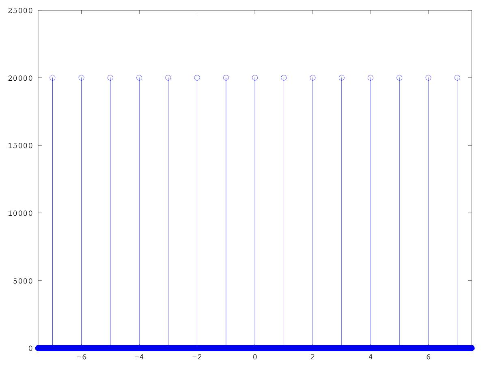

# CSEDSM 1 - Lezione del 30 gennaio 2018

## Argomenti

### Parametri dei fenomeni periodici discreti:

* fase: 
  * percezione

### Codice prodotto

#### l20180130_1.m

```matlab
fs = 10000;
sinc = 1/fs;
dur = 15;
t = [-dur/2:sinc:((dur/2)-sinc)];
freqs = [0:1:fs*2];
out = zeros(1, size(t, 2));
for(k = 1:size(freqs, 2))
  w = freqs(k)*2*pi;
  fase = 0;
  sig = cos(w*t + fase);
  out = out .+ sig;
  end
%out = out/size(freqs, 2);
stem(t, out);
axis([-dur/2 dur/2]);
```

produce




