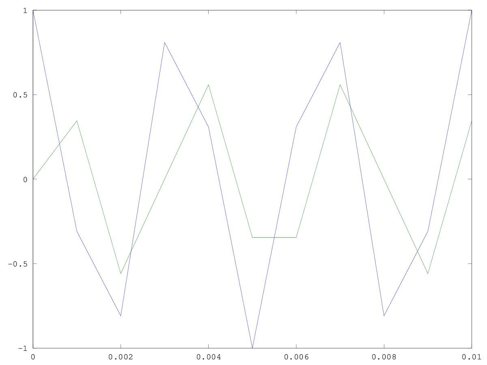

# CSEDSM 1 - Lezione del 13 marzo 2018

## Argomenti

### Introduzione all'elaborazione numerica dei segnali

* sistemi lineari
* sistemi tempo-invarianti
* sistemi LTI
* introduzione ai filtri:
  * FIR -> one-zero (filtro di media)
  * rappresentazione polare

## Lavagne


## Codice

### `20180313 Lezione.m`

```matlab
%Smussare un segnale, in termini matematici implica eliminare armoniche alte.
%LTI = lineari tempo invarianti.
%Un algoritmo è lineare quando al fronte di un raddoppio del segnale d'ingresso
%ottengo un raddoppio del segnale d'uscita.
%LTI è quando un'operazione non dipende dal tempo. Quindi l'algoritmo non cambia
%nel tempo. 
%I segnali causali sono tempo varianti in quanto prima dello "zero" non sono
%definiti. 
%I filtri con combinazioni di campioni solo in ingresso sono FIR (risposta finita)
%I filtri con combinazioni di campioni solo in uscita sono IIR (risposta infinita)


%y(k) = 0.5*x(k)+0.5*x(k-1) filtro one zero a coefficieni pari.
%y(k) fa la media fra il campione in ingresso e quello precedente. 
%Per questo motivo c'è un tempo di entrata a regime del filtro.

freqc = 1000;  %frequenza di campionamento
sinc = 1/freqc; %sample increment, passo
dur = 0.5;
f1 = 300;
w = 2*pi*f1;
k = [0:sinc:dur-sinc];
y = e.^(i*w*k); %il punto elabora campione a campione
out = zeros(1, size(k, 2));

for(n=2 : size(k, 2)) %n = 2 se no alla prima ricorsione si punta a campione inesistente.
out (n)= 0.5*y(n) + 0.5*y(n-1);
end

plot (k,y,k,out);
axis ([0 0.01]);
```

produce:



### `20180313 Lezione 2.m`

```matlab
freqc = 1;
W = [0 : 0.001*(2*pi) : freqc*(2*pi)]; %tutte le frequenze
n = 1; %prova anche non con interi
H = (1 + e.^(-i*W*n))*0.5;

figure (1);
plot (W, abs(H));

figure (2);
plot (W, angle(H)); 

%gli zeri del filtro sono a freq/n [Hz]. 
```

produce


