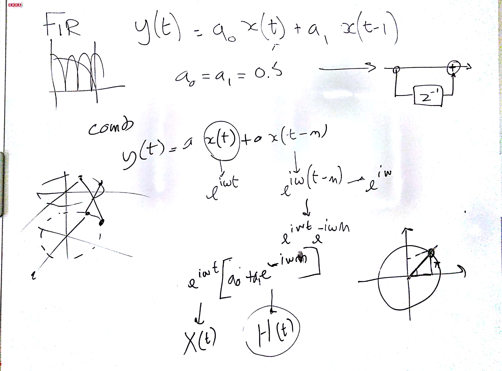
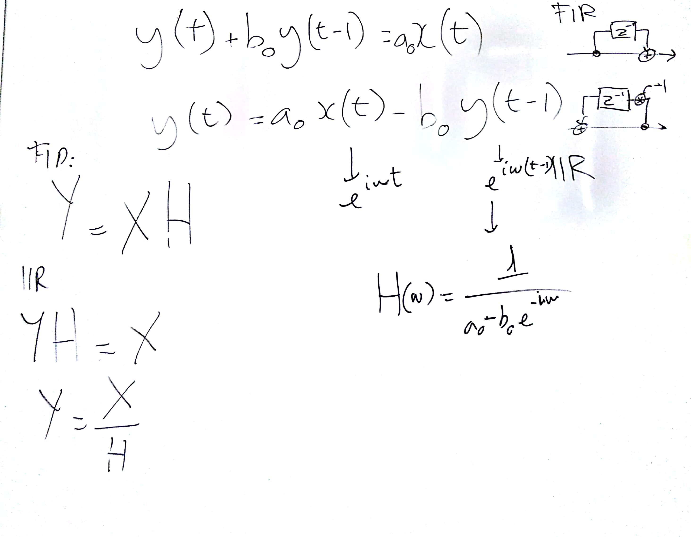
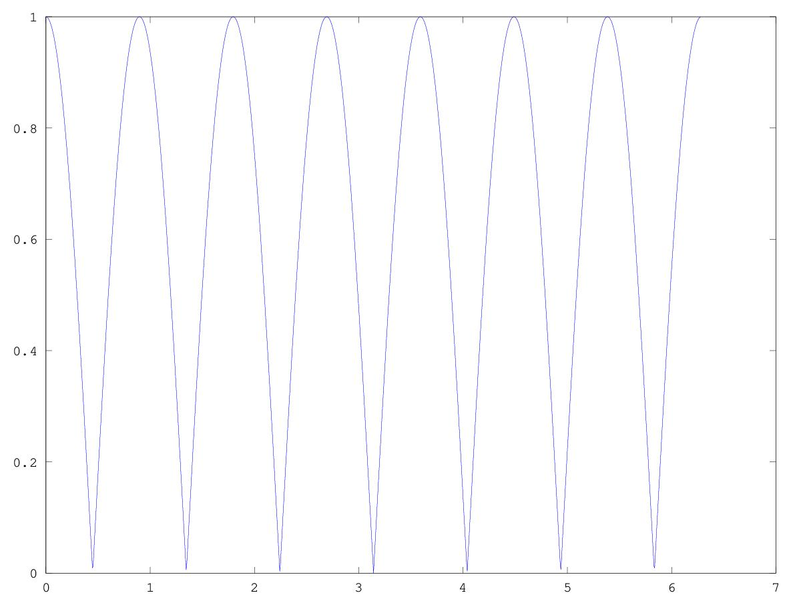
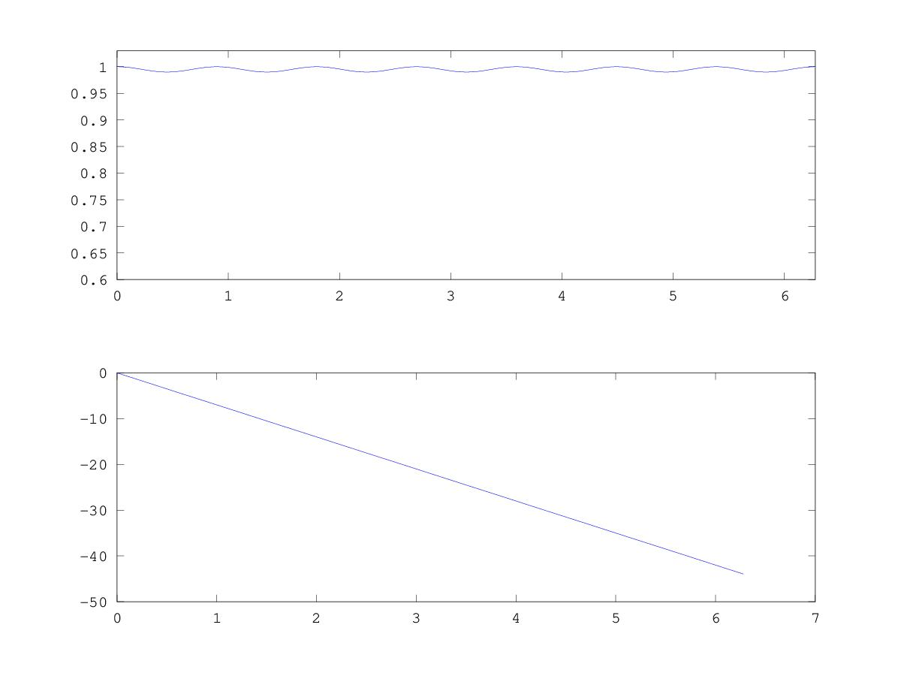
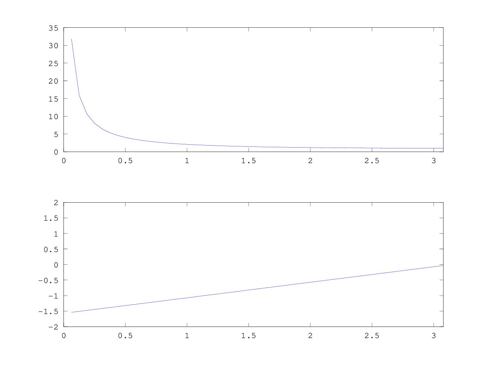

# CSEDSM 1 - Lezione del 10 aprile 2018

## Argomenti

### Introduzione all'elaborazione numerica dei segnali

* filtri FIR comb
* filtri IIR -> one-pole
* correlazione con filtri passivi e filtri attivi

## Lavagne





## Codice scritto in classe

### `comb_response1.m`

```matlab
%filtro comb
fc = 2*pi;
pf = 0.001*2*pi;

a=[0.5 0.5];
W = [0: pf : fc-pf];
% Y(t) = a0x(t) + a1x(t-n)
n = 7;
H = a(1)+(a(2)*e.^(-i*W*n));
%funzione complessa
%modulo della funzione
plot (W , abs(H))

%implementar il filtro su un segnale
```

produce:



### `comb_response2.m`

```matlab
%filtro comb
fc = 2*pi;
pf = 0.001*2*pi;

a=[0.005 0.995];
W = [0: pf: fc-pf];
% Y(t) = a0x(t) + a1x(t-n)
n = 7;
H = a(1)+(a(2)*e.^(-i*W*n));
%funzione complessa
%modulo della funzione
subplot(2, 1, 1)
plot (W , abs(H))
axis([W(1) W(end) 0.6 1.03])
subplot(2, 1, 2)
plot(W, unwrap(angle(H)))

%implementar il filtro su un segnale
```

produce:



### `IIR_1.m`

```matlab
% y(t) +b0*y(t-1) = a0*x(t)
% y(t) = a0*x(t) - b0*y(t-1)

%IIR 

fc = 2*pi;
pc = 0.01*2*pi;
a0 = 0.5;
b0 = 0.5;
W = [0 : pc : fc-pc];
H = 1./(a0 - b0*e.^(-i*W));
subplot(2, 1, 1)
plot (W, abs(H))
axis([W(1) W(size(W,2)/2)])
subplot (2, 1, 2)
plot (W, angle(H))
axis([W(1) W(size(W,2)/2)])
```

produce


