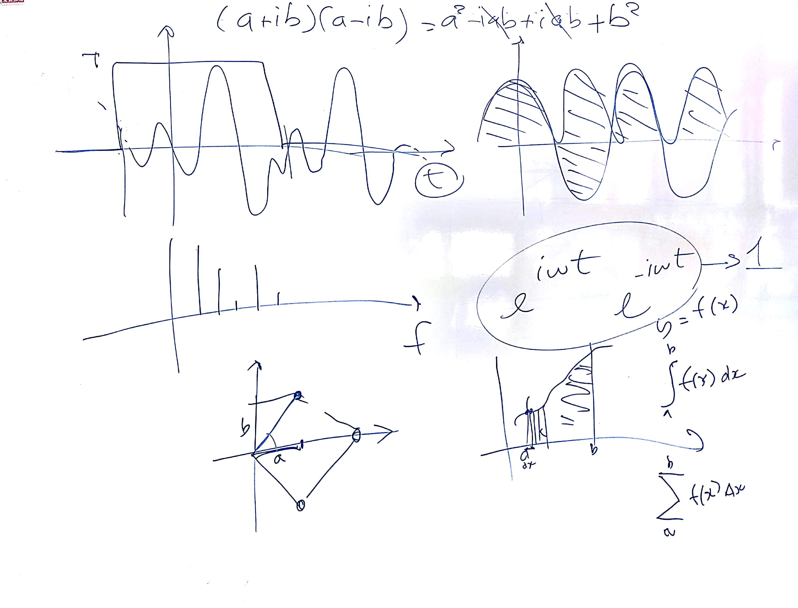
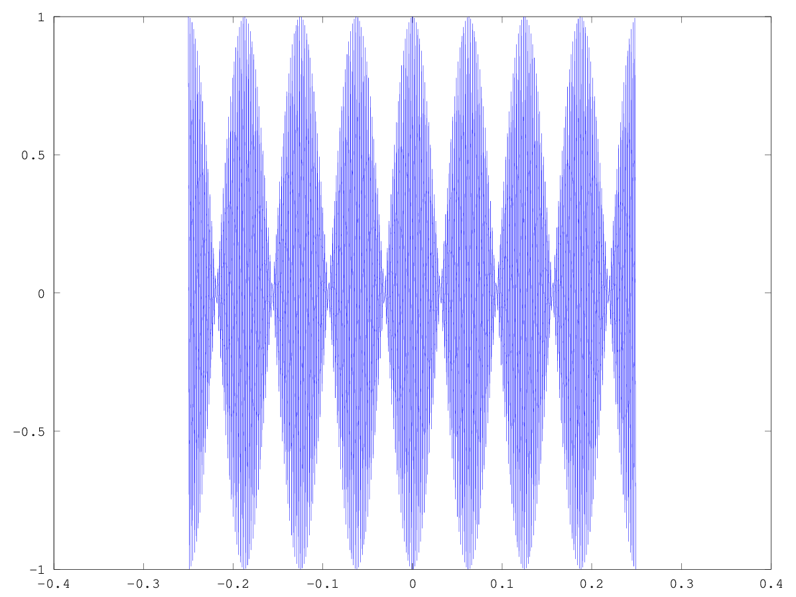
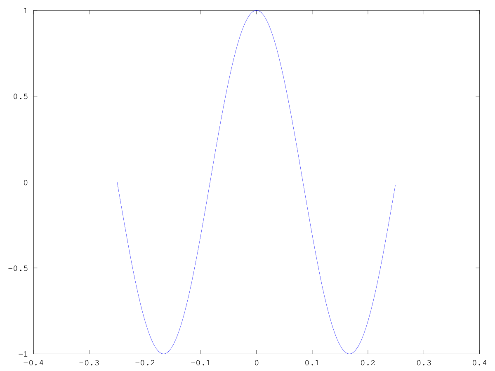
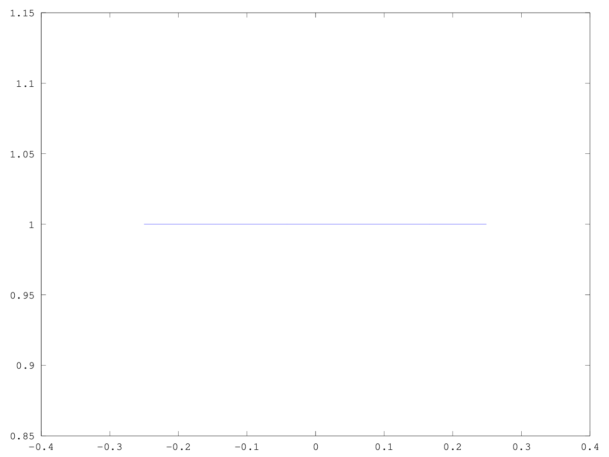
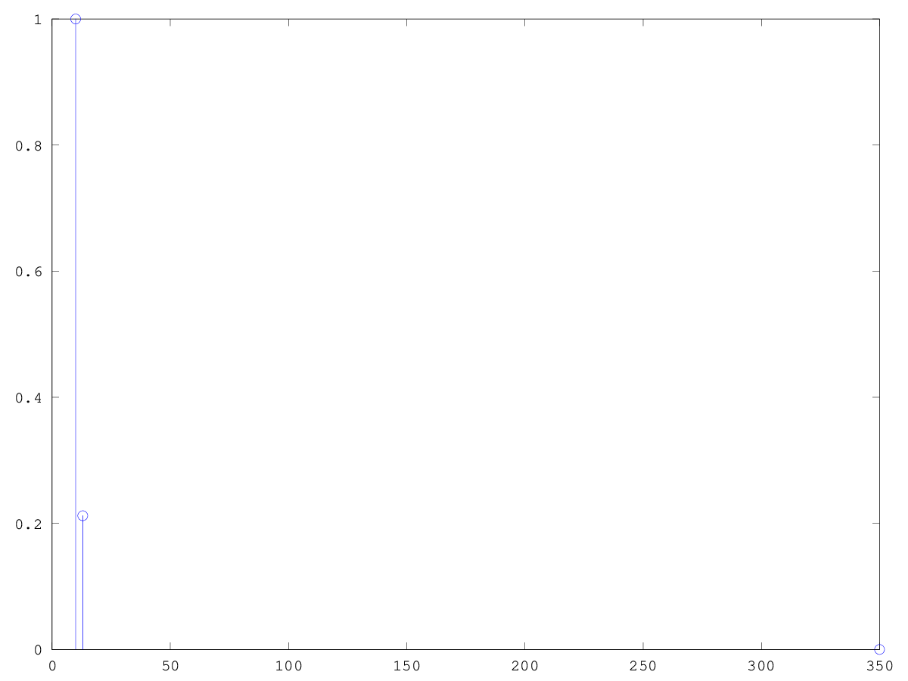
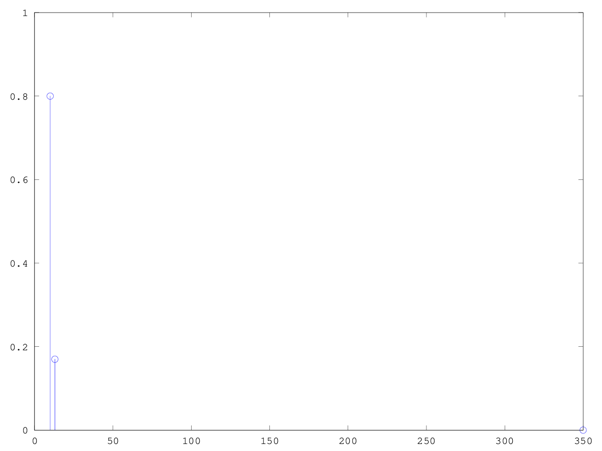
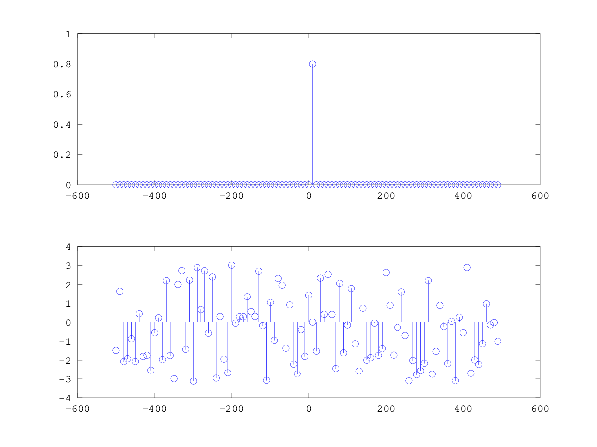
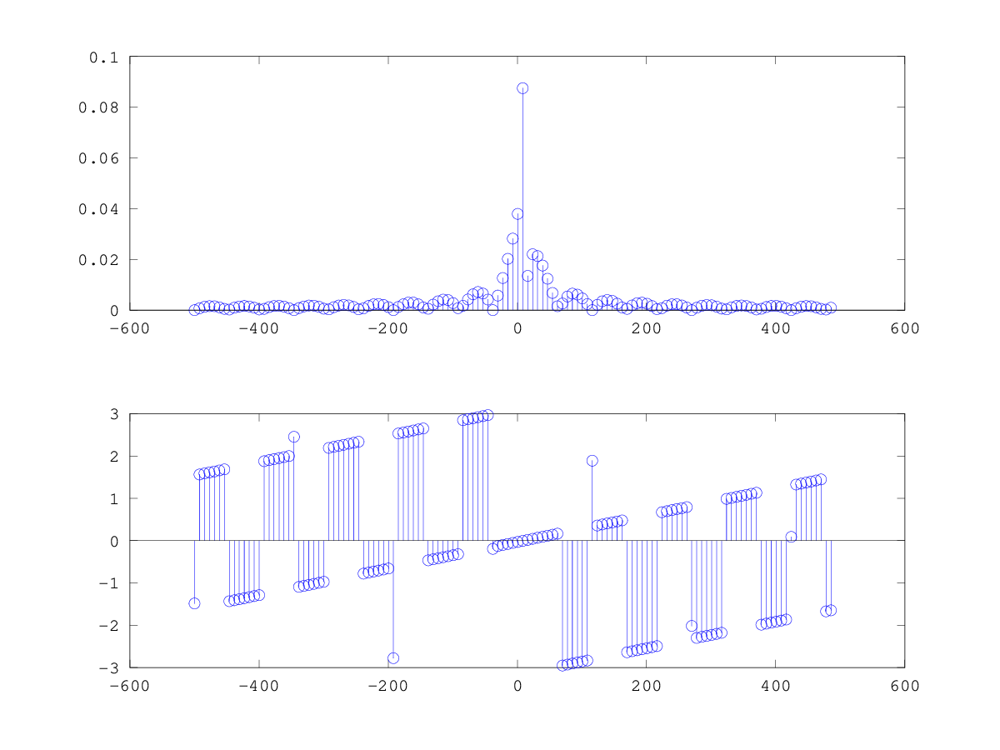

# CSEDSM 2 - Lezione del 15 novembre 2018

## Argomenti

* Le trasformazioni tempo-frequenza:
  * la scomposizione in serie di Fourier
  * realizzazione di esempi di integrali di Fourier a varie frequenze (`octave`) per una funzione periodica complessa
  * realizzazazione di un scompositore discreto di Fourier (`octave`) per una funzione periodica complessa

## Lavagne



## Codice

### [integrale di frequenze moltiplicate con rapporti 150.2, 1.3 e 1](./Scomp1_20181115_3_1.m)

```matlab
fc = 1000;
sinc = 1/fc;
dur = 0.5;
t = [-dur/2:sinc:dur/2-sinc];

f = 10;
w = 2*pi*f;

y = e.^(i*w*t);   %funzione

figure(1)
fanal1 = f*150.2;
y_anal1 = e.^(-i*fanal1*2*pi*t);
yr1 = y.*y_anal1;   %funzione risultante
plot (t, yr1);

figure(2)
fanal2 = f*1.3;
y_anal2 = e.^(-i*fanal2*2*pi*t);
yr2 = y.*y_anal2;   %funzione risultante
plot (t, yr2);

figure(3)
fanal3 = f;
y_anal3 = e.^(-i*fanal3*2*pi*t);
yr3 = y.*y_anal3;   %funzione risultante
plot (t, yr3);
```

Questo script produce i seguenti plot:







### [ri-fattorizzazione del codice precedente con plot frequenziale](./Scomp2_20181115_3_1.m)

```matlab
clear all;
close all;
 
fc = 1000;
sinc = 1/fc;
dur = 0.5;
t = [-dur/2:sinc:dur/2-sinc];

f = 10;
w = 2*pi*f;
F = [f, f*35, f*1.3];
y = e.^(i*w*t);   %funzione

figure(1)
fanal1 = F(2);
y_anal1 = e.^(-i*fanal1*2*pi*t);
yr1 = y.*y_anal1;   %funzione risultante
yft1 = abs(sum(yr1))/length(t);

fanal2 = F(3);
y_anal2 = e.^(-i*fanal2*2*pi*t);
yr2 = y.*y_anal2;   %funzione risultante
yft2 = abs(sum(yr2))/length(t);

fanal3 = F(1);
y_anal3 = e.^(-i*fanal3*2*pi*t);
yr3 = y.*y_anal3;   %funzione risultante
yft3 = abs(sum(yr3))/length(t);

hold on
stem(F(1), yft3);
stem(F(2), yft1);
stem(F(3), yft2);

hold off
```

Questo script produce il seguente plot:



### [riscalamento in ampiezza della funzione originale](./Scomp3_20181115_3_1.m)

```matlab
clear all;
close all;
 
fc = 1000;
sinc = 1/fc;
dur = 0.5;
t = [-dur/2:sinc:dur/2-sinc];

f = 10;
w = 2*pi*f;
F = [f, f*35, f*1.3];
y = 0.8*e.^(i*w*t);   %funzione

figure(1)
fanal1 = F(2);
y_anal1 = e.^(-i*fanal1*2*pi*t);
yr1 = y.*y_anal1;   %funzione risultante
yft1 = abs(sum(yr1))/length(t);

fanal2 = F(3);
y_anal2 = e.^(-i*fanal2*2*pi*t);
yr2 = y.*y_anal2;   %funzione risultante
yft2 = abs(sum(yr2))/length(t);

fanal3 = F(1);
y_anal3 = e.^(-i*fanal3*2*pi*t);
yr3 = y.*y_anal3;   %funzione risultante
yft3 = abs(sum(yr3))/length(t);

hold on
stem(F(1), yft3);
stem(F(2), yft1);
stem(F(3), yft2);

hold off
```

Questo script produce il seguente plot:



### [scomposizione in serie di Fourier con bin centrati](./DFD_20181115_3_1.m)

```matlab
clear all;
close all;
 
fc = 1000;
sinc = 1/fc;
dur = 0.5;
t = [-dur/2:sinc:dur/2-sinc];

binsize = 10;   %passo di campionamento delle frequenze.
F = [-fc/2:binsize:fc/2-binsize];

f = 10;
w = 2*pi*f;
y = 0.8*e.^(i*w*t);   %funzione

DFD = zeros (1, length(F));

for(k = 1:length(F))
fanal = F(k);
wanal = 2*pi*fanal;
yanal = e.^(-i*wanal*t);
yr = y.*yanal;
DFD(k) = sum(yr);
end

%plot(F, abs(DFD)/length(t));
subplot(2,1,1);
stem(F, abs(DFD)/length(t));
%axis([-20 25 -.1 1]);

subplot(2,1,2);
stem(F, angle(DFD));
```

Questo script produce il seguente plot:



### [scomposizione in serie di Fourier con bin non-centrati](./DFD_sfasciata_20181115_3_1.m)

```matlab
clear all;
close all;
 
fc = 1000;
sinc = 1/fc;
dur = 0.5;
t = [-dur/2:sinc:dur/2-sinc];

binsize = 7.7;   %passo di campionamento delle frequenze.
F = [-fc/2:binsize:fc/2-binsize];

f = 10;
w = 2*pi*f;
y = 0.8*e.^(i*w*t);   %funzione

DFD = zeros (1, length(F));

for(k = 1:length(F))
fanal = F(k);
wanal = 2*pi*fanal;
yanal = e.^(-i*wanal*t);
yr = y.*yanal;
DFD(k) = sum(yr);
end

%plot(F, abs(DFD)/length(t));
subplot(2,1,1);
stem(F, abs(DFD)/length(t));
%axis([-20 25 -.1 0.2]);

subplot(2,1,2);
stem(F, angle(DFD));
```

Questo script produce il seguente plot:


