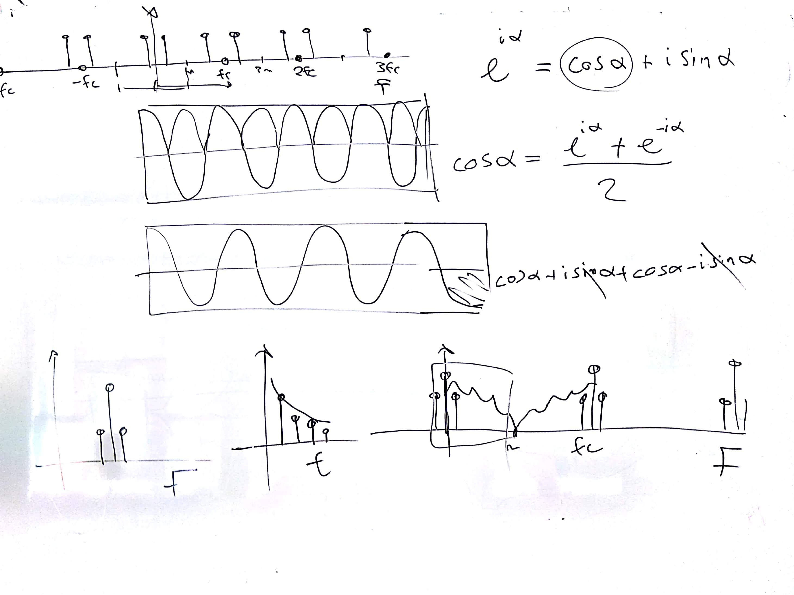
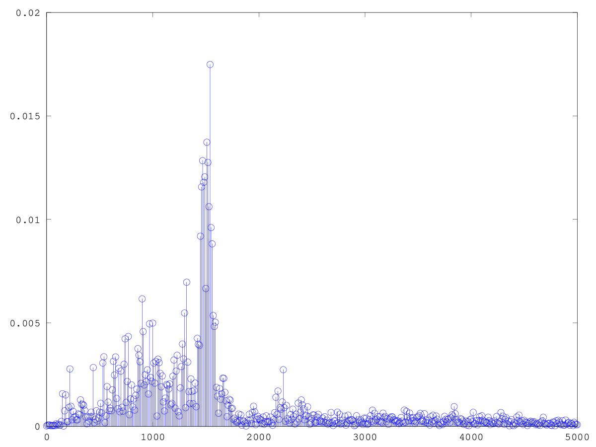

# CSEDSM 2 - Lezione del 29 novembre 2018

## Argomenti

* Le trasformazioni tempo-frequenza:
  * la scomposizione in serie di Fourier per segnali reali
  * la scomposizione in serie di Fourier di suoni reali
  * il modello *impulsivo* del campionamento

## Lavagne



## Codice `matlab`

[scomposizione di un segnale reale e concreto](./scomp_real_real.m)

```matlab
clear all;
close all;
%causale
[y fc] = audioread("senza_titolo.wav");
y = y'; % convertiamo righe in colonne
sinc = 1/fc;
dur = length(y)/fc;
t = [0:sinc:dur-sinc];

binsize = 10;   %passo di campionamento delle frequenze.
F = [0:binsize:fc-binsize];


DFD = zeros (1, length(F));

for(k = 1:length(F))
fanal = F(k);
wanal = 2*pi*fanal;
yanal = e.^(-i*wanal*t);
yr = y.*yanal;
DFD(k) = sum(yr);
end

%plot(F, abs(DFD)/length(t));

stem(F, abs(DFD)/length(t));
axis([0 5000]);
```

Questo script produce il plot che segue:


