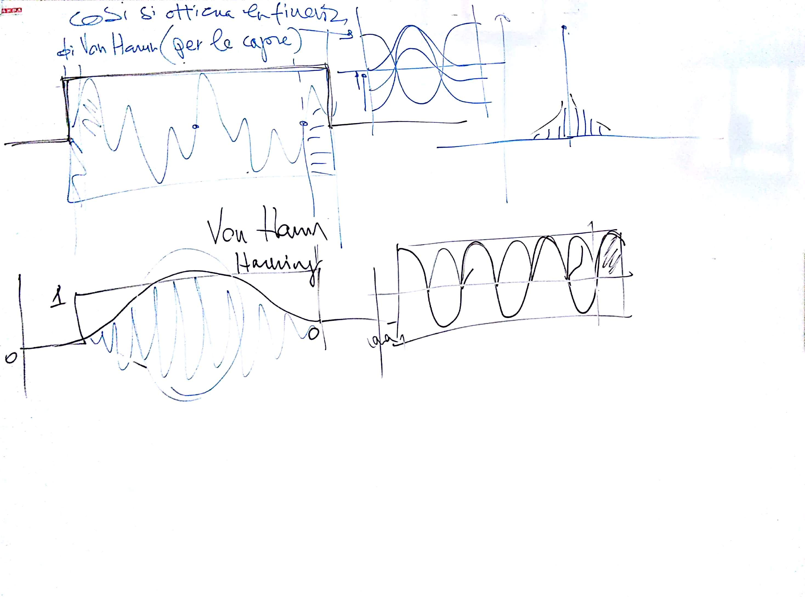
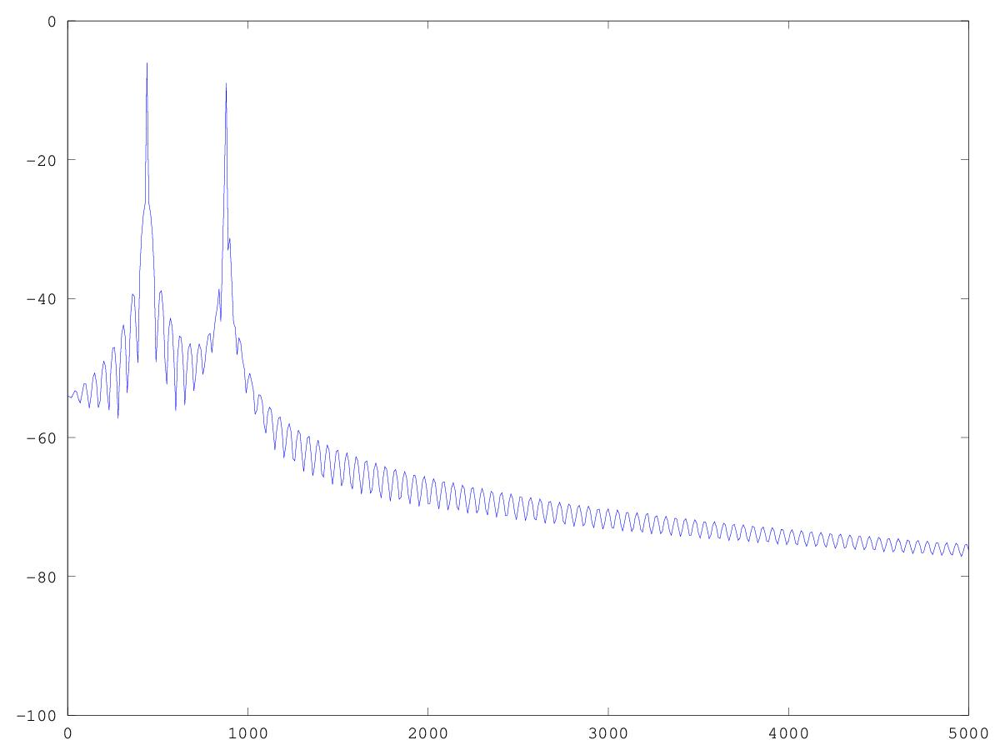
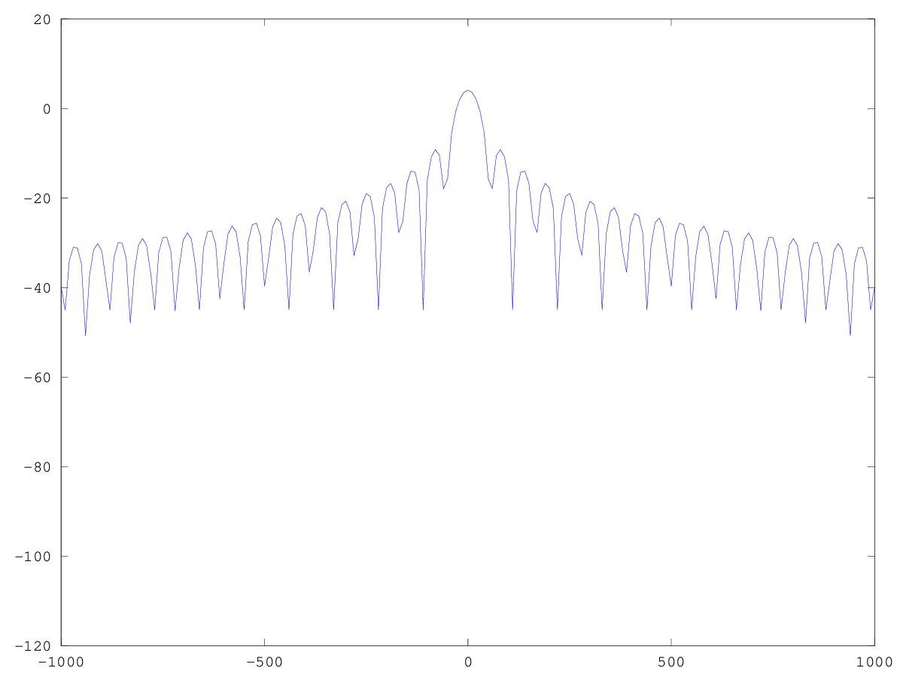
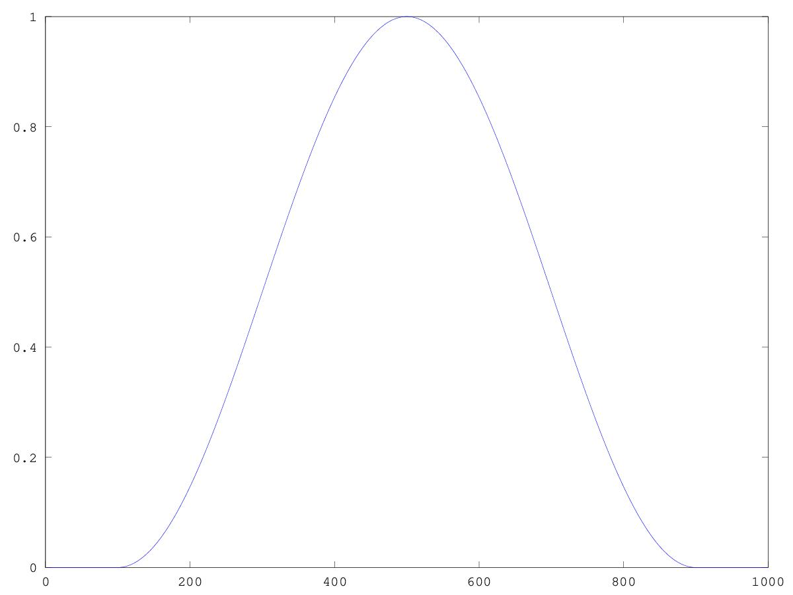
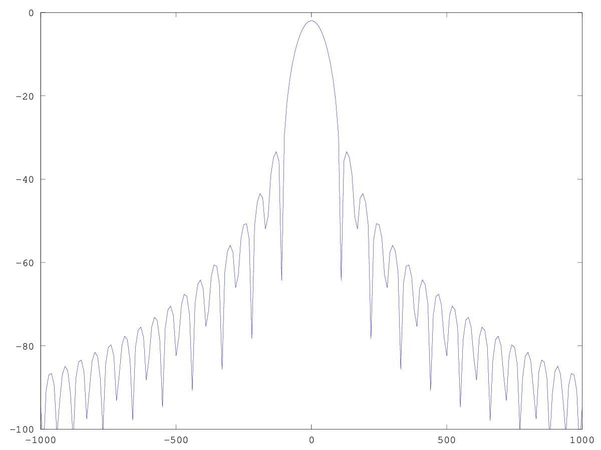

# CSEDSM 2 - Lezione del 6 dicembre 2018

## Argomenti

* Le trasformazioni tempo-frequenza:
  * magnitudine lineare e magnitudine in dB
  * rumore della scomposizione:
    * scomposizione di una finestra boxcar
    * scomposizione di una finestra di Von Hann
  * riduzione del rumore:
    * finestra boxcar (rettangolare)
    * finestra di Von Hann (hanning)

## Lavagne



## Esempi `octave`

### Esempio 1: [scomposizione di un segnale reale - magnitudine in `dB`](./scomp_real_real2.m)

```matlab
clear all;
close all;

%Il segnale audio è di natura causale. 
[y fc] = audioread("test.wav");
y = y(1:8000)'; % prendiamo solo i primi 8000 campioni convertiamo righe in colonne
sinc = 1/fc;
dur = length(y)/fc;
t = [0:sinc:dur-sinc];

binsize = 10;   %passo di campionamento delle frequenze.
F = [0:binsize:fc-binsize];


DFD = zeros (1, length(F));

for(k = 1:length(F))
  fanal = F(k);
  wanal = 2*pi*fanal;
  yanal = e.^(-i*wanal*t);
  yr = y.*yanal;
  DFD(k) = sum(yr);
end

%plot(F, abs(DFD)/length(t));

plot(F, 20*log10(2*abs(DFD)/length(t)));
axis([0 5000 -100 0]); %Limitando la visione ai primi 5 kHz non si vede la simmetria.
```

Questo script produce il seguente plot:



### Esempio 2: [rappresentazione spettrale di una finestra `boxcar` (rettangolare) - magnitudine in `dB`](./boxcar_window.m)

```matlab
clear all;
close all;

fc = 44100;
sinc = 1/fc;

%Creo un segnale con una finestra rettangolare. 
y = ones(1, 1000);
y(1:100) = 0;
y(900:end) = 0;

dur = length(y)/fc;
t = [0:sinc:dur-sinc];

binsize = 10;   %passo di campionamento delle frequenze.
F = [-fc/2:binsize:fc/2-binsize];


DFD = zeros (1, length(F));

for(k = 1:length(F))
  fanal = F(k);
  wanal = 2*pi*fanal;
  yanal = e.^(-i*wanal*t);
  yr = y.*yanal;
  DFD(k) = sum(yr);
end

%plot(F, abs(DFD)/length(t));

plot(F, 20*log10(2*abs(DFD)/length(t)));
axis([-1000 1000]); %Limitando la visione ai primi 5 kHz non si vede la simmetria.
```

Questo script produce il seguente plot:



### Esempio 3: [rappresentazione spettrale di una finestra di `Von Hann` (`hanning`) - magnitudine in `dB`](./hanningwindow.m)

```matlab
clear all;
close all;

fc = 44100;
sinc = 1/fc;

%Creo un segnale con una finestra cosinusoidale rovesciata. 
y = zeros(1, 1000);
y(100:899) = 0.5-(0.5*cos((1/800*2*pi)*[0:799]));

dur = length(y)/fc;
t = [0:sinc:dur-sinc];

binsize = 10;   %passo di campionamento delle frequenze.
F = [-fc/2:binsize:fc/2-binsize];


DFD = zeros (1, length(F));

for(k = 1:length(F))
  fanal = F(k);
  wanal = 2*pi*fanal;
  yanal = e.^(-i*wanal*t);
  yr = y.*yanal;
  DFD(k) = sum(yr);
end

%plot(F, abs(DFD)/length(t));

figure(1)
plot (y);

figure(2)
plot(F, 20*log10(2*abs(DFD)/length(t)));
axis([-1000 1000 -100 0]); %Limitando la visione ai primi 5 kHz non si vede la simmetria.
```

Questo script produce i seguenti plot:




