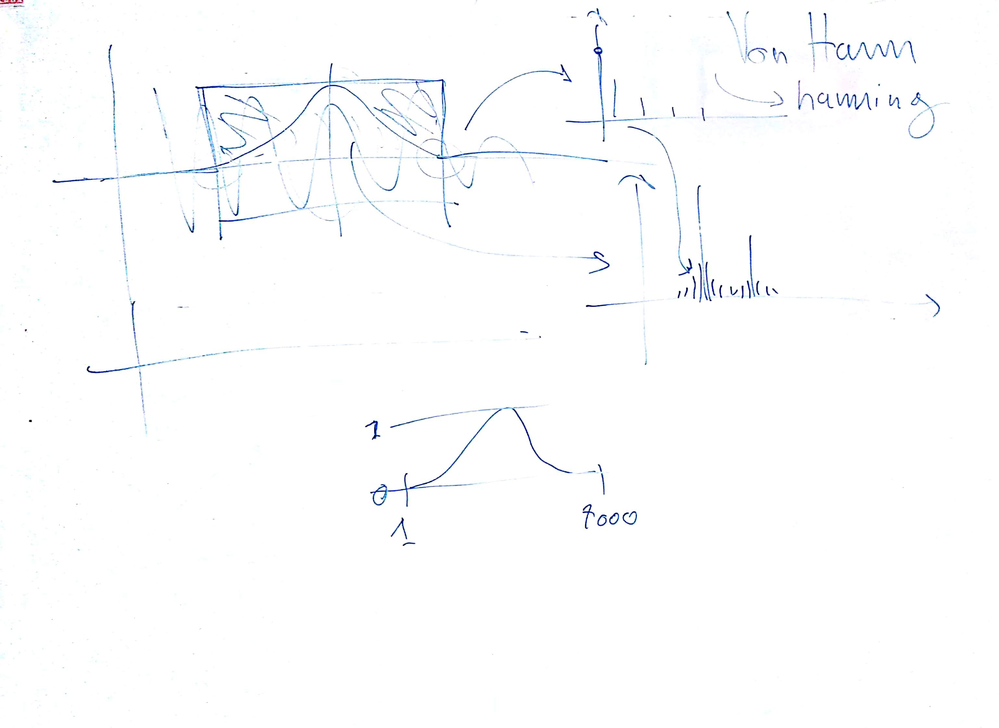
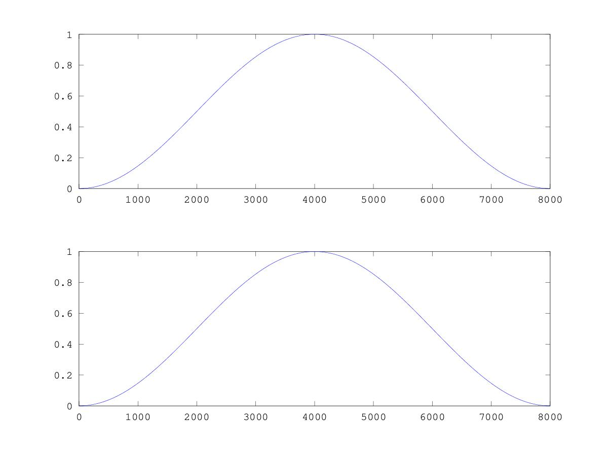
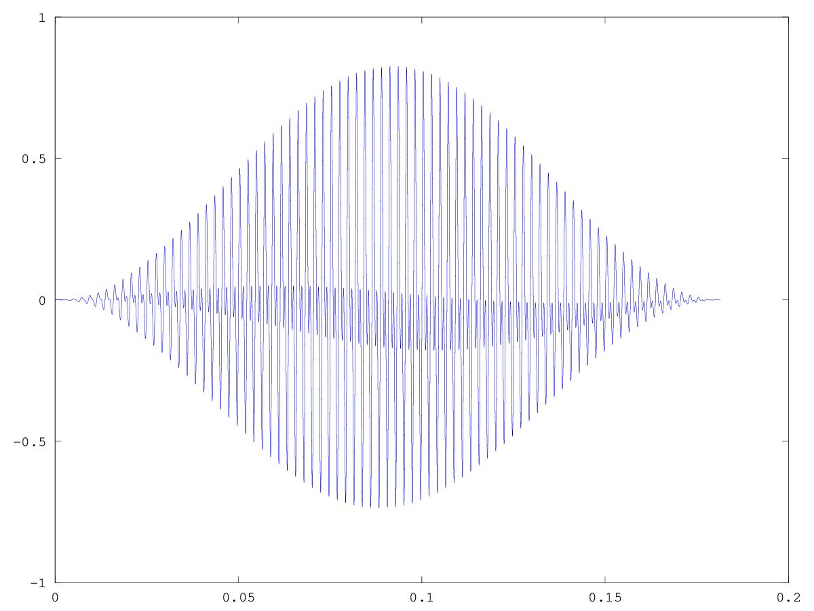
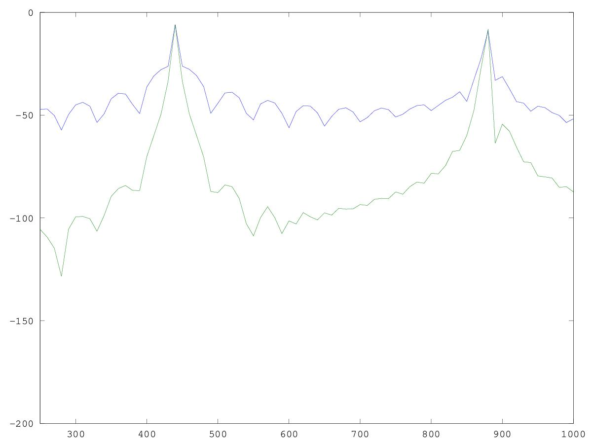

# CSEDSM 2 - Lezione del 13 dicembre 2018

## Argomenti

* Le trasformazioni tempo-frequenza:
  * rumore della scomposizione:
    * scomposizione di una finestra boxcar
    * scomposizione di una finestra di Von Hann
  * riduzione del rumore:
    * finestra boxcar (rettangolare)
    * finestra di Von Hann (hanning)
  * finestre simmetriche vs. finestre asimmetriche
  * zero-phase windowing
  * realizzazione pratica del zero-phase windowing (inversione delle finestre)
  * zero-padding dei bordi (interpolazione lineare dei punti)

## Lavagne



## Codice `octave`

[scomposizione e misurazione dello spettro con finestre boxcar e Von Hann](./scomp5.m)

```matlab
[y, fc] = audioread("test.wav");
wsize = 8000;
y=y(1:wsize)';%prende solo i primi 8000 campione e poi inverte tutto

passo= 1/fc;
dur=length(y)/fc;
t=[0:passo:dur-passo];
%y = 0.5*cos(440*2*pi*t(1:wsize));
binsize= 10; %passo di campionamento delle frequenze
F=[0:binsize:fc-binsize];


win = [0 : wsize-1];
H = -0.5*cos(((2*pi)/wsize)*win)+0.5;   %finestra di hanning
hh = hanning(wsize)';

figure (1);
subplot (2, 1, 1)
plot (win, H)
subplot (2, 1, 2)
plot (win, hh)
figure (2)

yh = y.*hh;    #segnale finestrato
plot (t, yh)
figure (3)


DFD= zeros (1, length(F)); %array di una riga, lenght di f colonne
dfdh = zeros (1, length(F));

for(k=1 : length(F))
fanal= F(k);
wanal=2*pi*fanal;
yanal=e.^(-i*wanal*t);
yr=y.*yanal;
yrh = yh.*yanal;
DFD(k)= sum(yr);
dfdh (k) = sum (yrh);
end

#fattore di normalizzazione
bfact = (wsize / sum(ones(1, wsize)))/wsize;       #scalare di finestra rettangolare
hfact = (wsize/sum(hh))/wsize;                     #scalare finestra hanning

plot(F,20*log10(2* abs(DFD)*bfact), F, 20*log10(2* abs(dfdh)*hfact));
axis([250 1000 -200 0]);
```

Questo codice produce i seguenti grafici:



Confronto tra la finestra di von Hann generata da noi e quella già inclusa in `octave`.



Segnale rimodulato con la finestra di von Hann



Confronto tra lo spettro del segnale modulato con finestre *boxcar* e con finestra di *von Hann*
