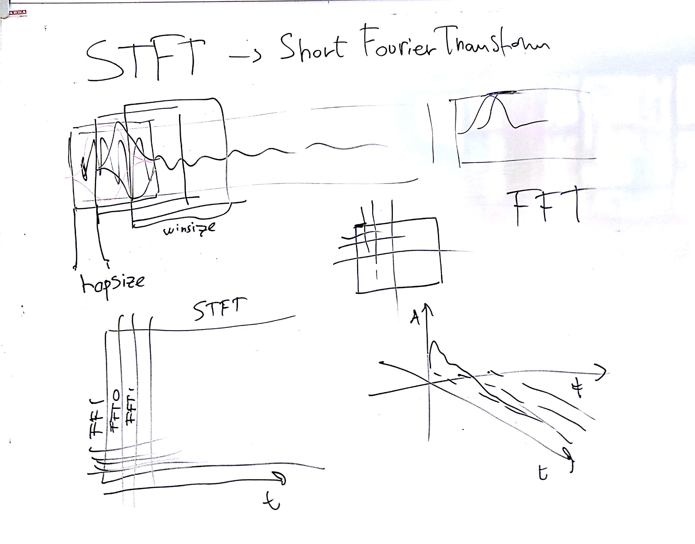
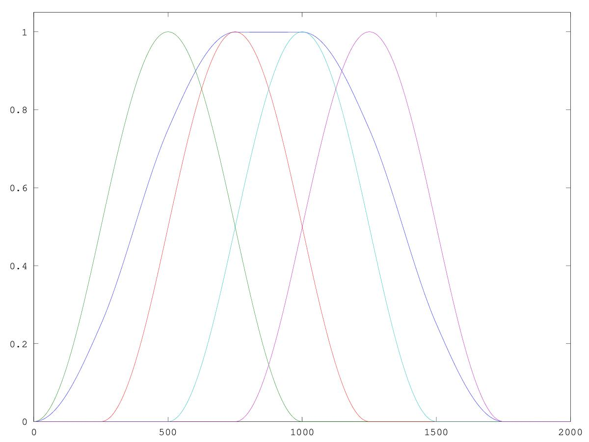
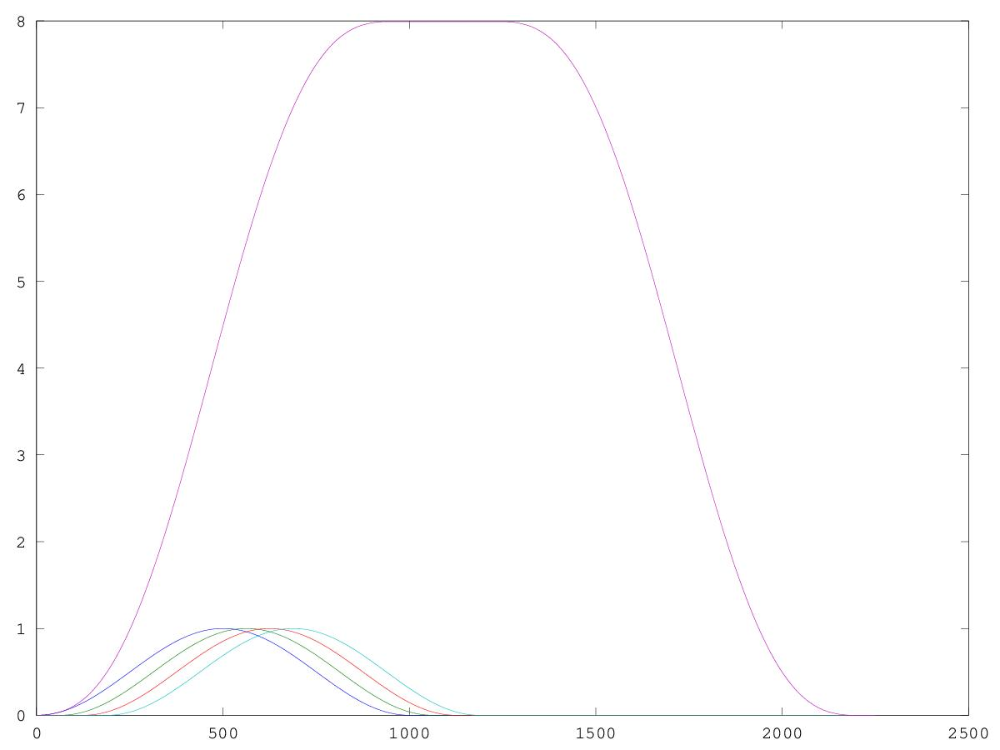
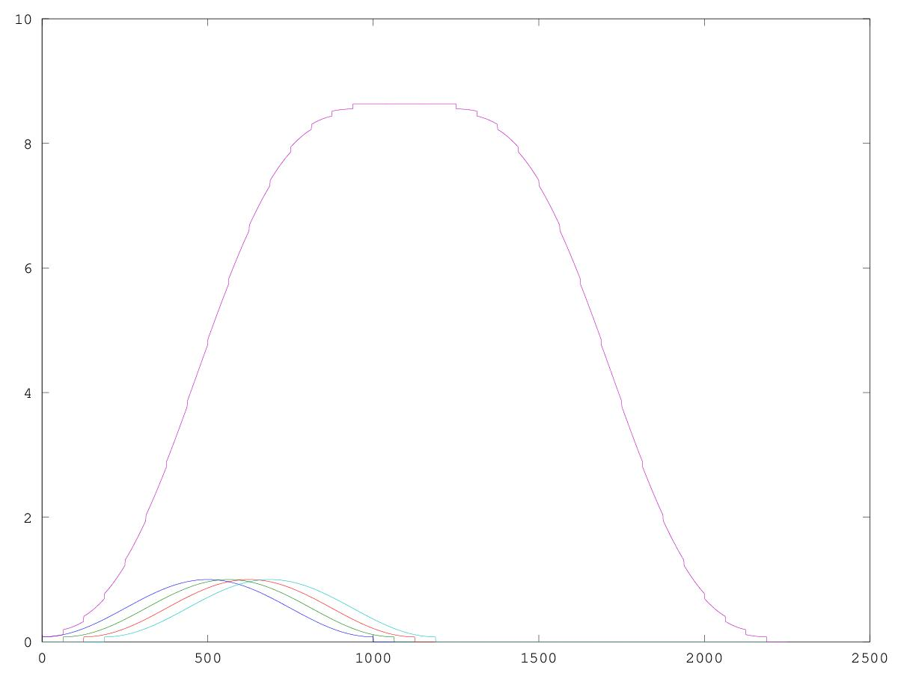
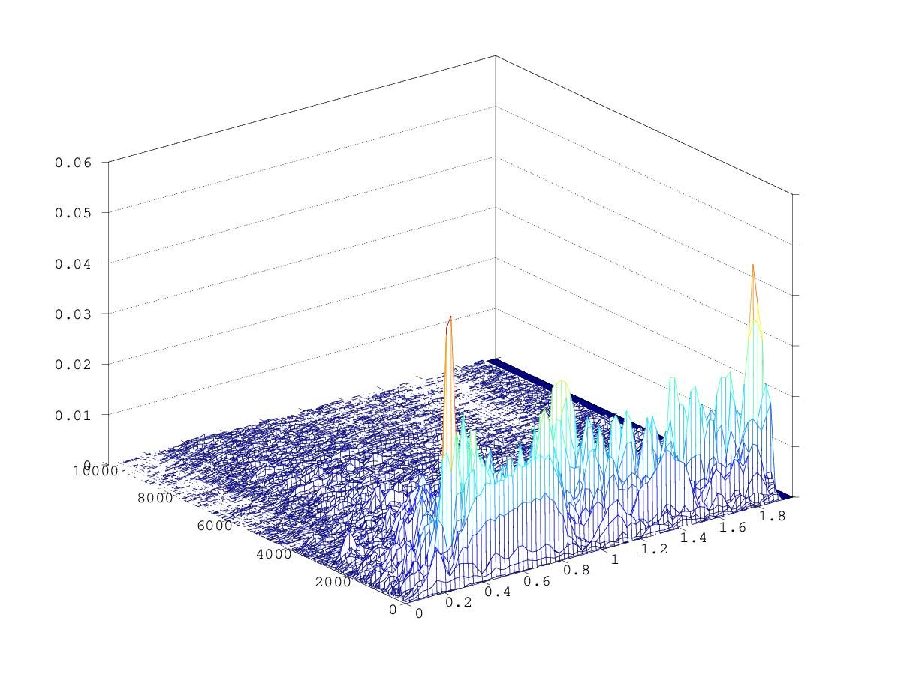
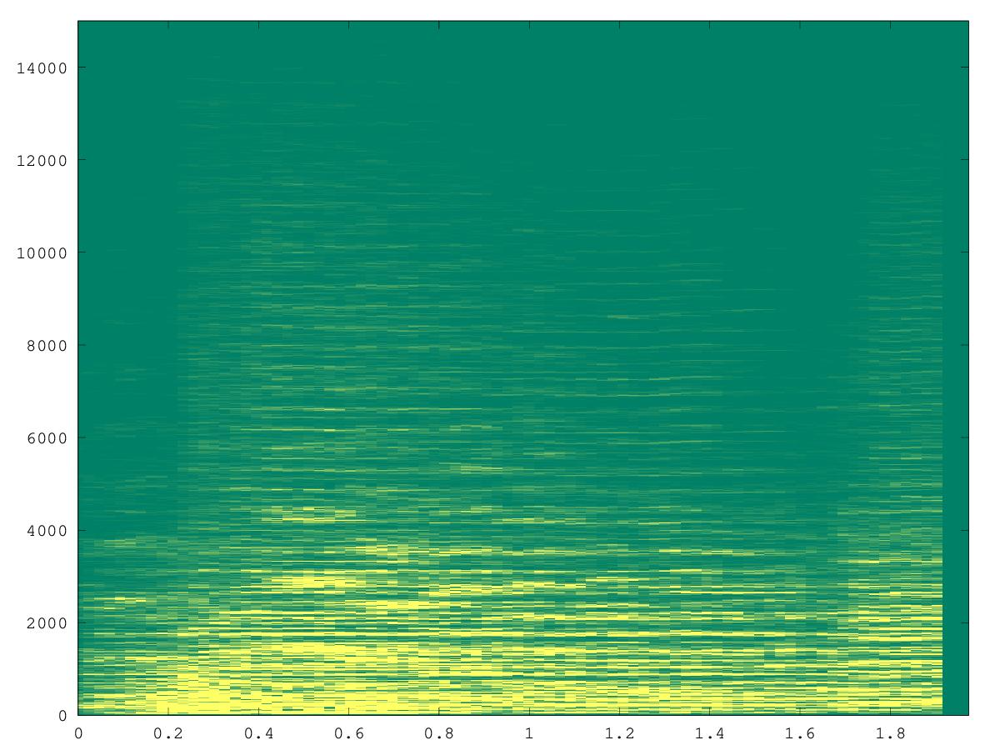

# CSEDSM 2 - Lezione del 20 dicembre 2018

## Argomenti

* Il compromesso tempo-frequenza:
  * molta definizione frequenziale -> poca definizione temporale
* Introduzione alla *Short Time Fourier Transform* (STFT):
  * principi di funzionamento
  * parametri fondamentali di riferimento:
    * window size
    * hop size
* Tecniche di rappresentazione spettrale
  * waterfall
  * spettrogramma

## Lavagne



## Codice `octave`

[Overlap di finestre di hanning](./overlap.m)

```matlab
winsize=1000;
overlap=4;
hopsize=winsize/overlap;
rescale=2/overlap;
h=hanning(winsize)';
nwin=4;
out=zeros(nwin+1, hopsize*nwin+winsize);
x=[1:length(out)];

for k=1:nwin 
inizio=(k-1)*hopsize+1;
fine=(inizio+winsize)-1;
out(1,inizio:fine)=out(1,inizio:fine).+h;
out(k+1,inizio:fine)=h;
end

plot(x, out(1,:)*rescale,x, out(2,:),x, out(3,:),x, out(4,:),x, out(5,:))

```
Questo codice produce il grafico seguente:



[Rescaling delle finestre di hanning](./overlap2.m)

```matlab
clear all
close all

winsize=1000;
overlap=16;
hopsize=winsize/overlap;
rescale=2/overlap;
h=hanning(winsize)';
nwin=20;
out=zeros(nwin+1, hopsize*nwin+winsize);
x=[1:length(out)];

for k=1:nwin 
inizio=(k-1)*hopsize+1;
fine=(inizio+winsize)-1;
out(1,inizio:fine)=out(1,inizio:fine).+h;
out(k+1,inizio:fine)=h;
end

plot(x, out(2,:),x, out(3,:),x, out(4,:),x, out(5,:),x, out(1,:))
```

Questo codice produce il grafico seguente:



[Rescaling delle finestre di hamming](./overlap3.m)

```matlab
clear all
close all

winsize=1000;
overlap=16;
hopsize=winsize/overlap;
rescale=2/overlap;
h=hamming(winsize)';
nwin=20;
out=zeros(nwin+1, hopsize*nwin+winsize);
x=[1:length(out)];

for k=1:nwin 
inizio=(k-1)*hopsize+1;
fine=(inizio+winsize)-1;
out(1,inizio:fine)=out(1,inizio:fine).+h;
out(k+1,inizio:fine)=h;
end

plot(x, out(2,:),x, out(3,:),x, out(4,:),x, out(5,:),x, out(1,:))

```

Questo codice produce il grafico seguente:



[Short time fourier transform](./stft0.m)

```matlab
clear all
close all
[y, fs]=audioread("webern-op1-theme.wav");
dur=2;
y=y(1:fs*2,1);
winsize=2^12; %4096
binsize=fs/winsize;
overlap=4;
hopsize=winsize/overlap;
rescale=2/overlap;
h=hanning(winsize);
nwin=round(((dur*fs))/(hopsize));
my_stft=zeros(winsize, nwin);
step=hopsize/fs;
t=[0:step:dur-step];
f=[0:binsize:fs-binsize];

for k=1:nwin-(overlap-1) 
inizio=(k-1)*hopsize+1;
fine=(inizio+winsize)-1;
yh=y(inizio:fine).*h;%segnale finestrato
anal=fft(yh);%restituisce vettore di valori complessi
my_stft(:,k)=anal;
end

mesh(t,f,(abs(my_stft)*rescale*2)/winsize)%plot 3d
axis([t(1) t(end) 0 10000])

```

Questo codice produce il grafico seguente:



[Spettrogramma](./stft0_spectro.m)

```matlab
clear all
close all
[y, fs]=audioread("webern-op1-theme.wav");
dur=2;
y=y(1:fs*2,1);
winsize=2^12; %4096
binsize=fs/winsize;
overlap=4;
hopsize=winsize/overlap;
rescale=2/overlap;
h=hanning(winsize);
nwin=round(((dur*fs))/(hopsize));
my_stft=zeros(winsize, nwin);
step=hopsize/fs;
t=[0:step:dur-step];
f=[0:binsize:fs-binsize];

for k=1:nwin-(overlap-1) 
inizio=(k-1)*hopsize+1;
fine=(inizio+winsize)-1;
yh=y(inizio:fine).*h;%segnale finestrato
anal=fft(yh);%restituisce vettore di valori complessi
my_stft(:,k)=anal;
end

my_stftmag=((abs(my_stft(1:winsize/2, :))*rescale*2)/winsize);
colormap("summer");
norm=1./max(max(my_stftmag))*length(colormap);
image([t(1) t(end)], [f(winsize/2) f(1)],flipud(my_stftmag)*norm*15)
axis([t(1) t(end) 0 15000])

```

Questo codice produce il grafico seguente:


