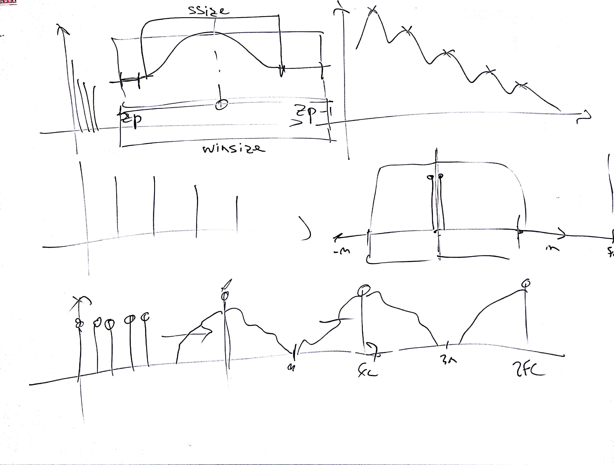
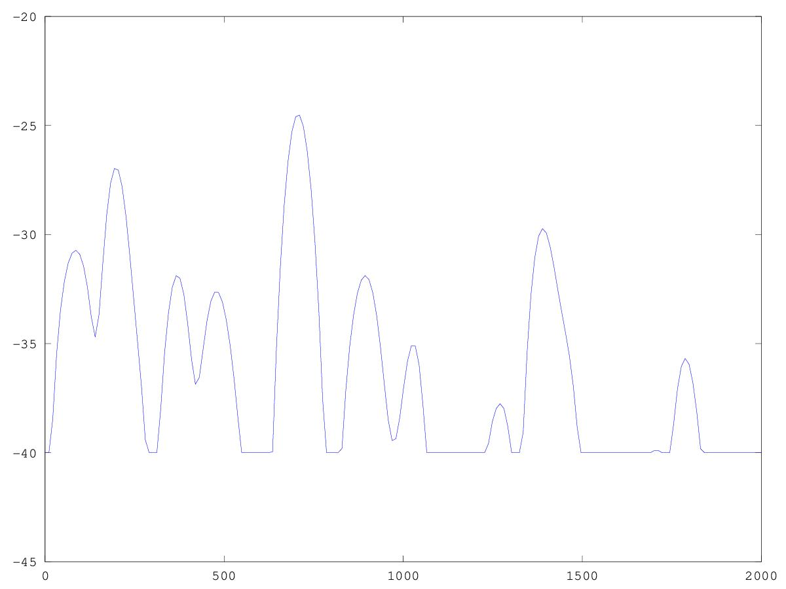
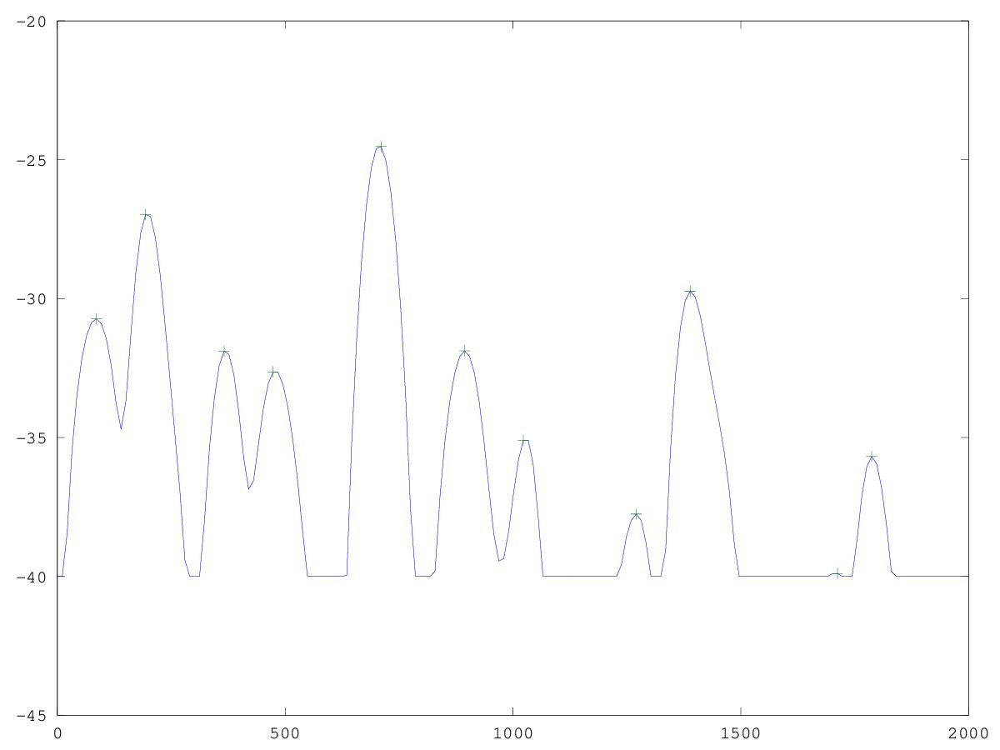

# CSEDSM 2 - Lezione del 10 gennaio 2019

## Argomenti

* Quantità d'informazione della STFT
* Feature extraction:
  * tracking delle parziali:
    * thresholding
    * peak detection

## Lavagne



## Codice `octave` elaborato durante la lezione:

### [Zero-padding e elaborazione della soglia](./Zero_Pad_Soglia.m)

```matlab
[y, fs]=audioread("webern-op1-theme.wav");
dur=2;
y=y(1:fs*2,1);

winsize = 2^12; %4096
binsize = fs/winsize;
ssize = (2^10) - 1;
h = hanning(ssize); %Per ottenere lo zeropadding

zp = ceil((winsize - ssize)/2);  %Arrotondameto per eccesso.


overlap = 4;
hopsize = winsize/overlap;    %Hopsize di 1/4
rescale = 2/overlap;

nwin = round(((dur*fs))/(hopsize)); %Arrotondameto intelligente

fatrescale = 1/sum(h);  %Rescale sulla finestra di hanning. 
my_stft = zeros(winsize, nwin); %Matrice.

step = hopsize/fs;    %Convertiamo l'hopsize in durata.
t = [0:step:dur-step];  %Asse dei tempi.
f = [0:binsize:fs-binsize]; %Asse delle frequenze.

for k = 50:51  %Scelgo arbitrariamente una "fetta".
inizio = (k-1)*hopsize+1;
fine = (inizio+ssize)-1;
yh = y(inizio:fine).*h;     %Segnale finestrato.
fftbuffer = zeros(winsize, 1);
fftbuffer (zp:zp+ssize-1) = yh;
anal = fft(fftbuffer);             %Restituisce vettore di valori complessi.
my_stft(:,k) = anal;
end


mag = 20*log10(abs(my_stft(:,50))*fatrescale);

threshold = -40;  %Soglia di isolamento dei picchi. 
logic = (mag > threshold);  %Tutti i valori al di sotto di threshold sono posti in un vettore a 0.
%I valori al di sopra di threshold li pongo a 1. 
mag = ((mag - threshold) .* logic) + threshold; %Interpolo mag con logic

plot(f, mag);
axis([0 2000 -45 -20])
```

Questo codice produce il seguente grafico:



[Rilevazione dei picchi](./Peak_P.m)

```matlab
[y, fs]=audioread("webern-op1-theme.wav");
dur=2;
y=y(1:fs*2,1);

winsize = 2^12; %4096
binsize = fs/winsize;
ssize = (2^10) - 1;
h = hanning(ssize); %Per ottenere lo zeropadding

zp = ceil((winsize - ssize)/2);  %Arrotondameto per eccesso.


overlap = 4;
hopsize = winsize/overlap;    %Hopsize di 1/4
rescale = 2/overlap;

nwin = round(((dur*fs))/(hopsize)); %Arrotondameto intelligente

fatrescale = 1/sum(h);  %Rescale sulla finestra di hanning. 
my_stft = zeros(winsize, nwin); %Matrice.

step = hopsize/fs;    %Convertiamo l'hopsize in durata.
t = [0:step:dur-step];  %Asse dei tempi.
f = [0:binsize:fs-binsize]; %Asse delle frequenze.

for k = 50:51  %Scelgo arbitrariamente una "fetta".
inizio = (k-1)*hopsize+1;
fine = (inizio+ssize)-1;
yh = y(inizio:fine).*h;     %Segnale finestrato.
fftbuffer = zeros(winsize, 1);
fftbuffer (zp:zp+ssize-1) = yh;
anal = fft(fftbuffer);             %Restituisce vettore di valori complessi.
my_stft(:,k) = anal;
end


mag = 20*log10(abs(my_stft(:,50))*fatrescale);

threshold = -40;  %Soglia di isolamento dei picchi. 
logic = (mag > threshold);  %Tutti i valori al di sotto di threshold sono posti in un vettore a 0.
%I valori al di sopra di threshold li pongo a 1. 
mag = ((mag - threshold) .* logic) + threshold; %Interpolo mag con logic.

peaks = []; %Array dinamico per frequenze.
mags = [];  %Array dinamico per magnitudini.
npeak = 1;  %Indice per la scrittura all'interno di peak.

for k = 1:(length(mag)/2-3) %Dal primo campione a nyquist meno 3 campioni.
  f3 = mag(k:k+2);
  [m, mindex] = max(f3);
  
  if mindex == 2
    peaks(npeak) = f(k+1); %
    mags(npeak) = mag(k+1);
    npeak++;
  endif
  
endfor

plot(f, mag, peaks, mags, "+");
axis([0 2000 -45 -20])
```

Questo codice produce il seguente grafico:



