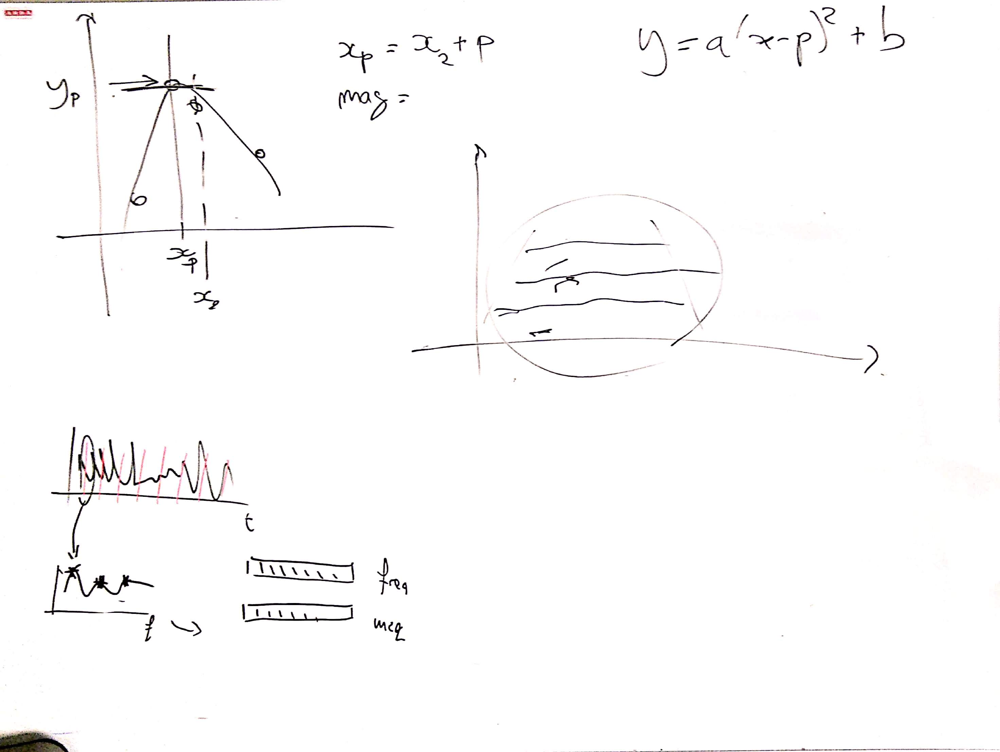
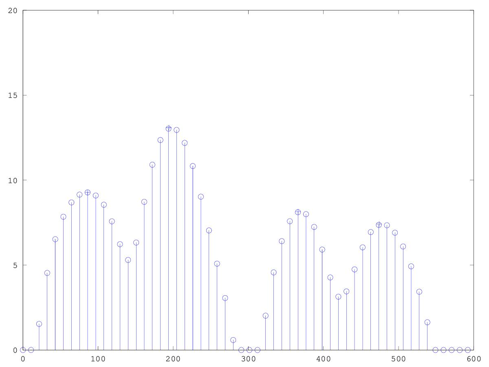
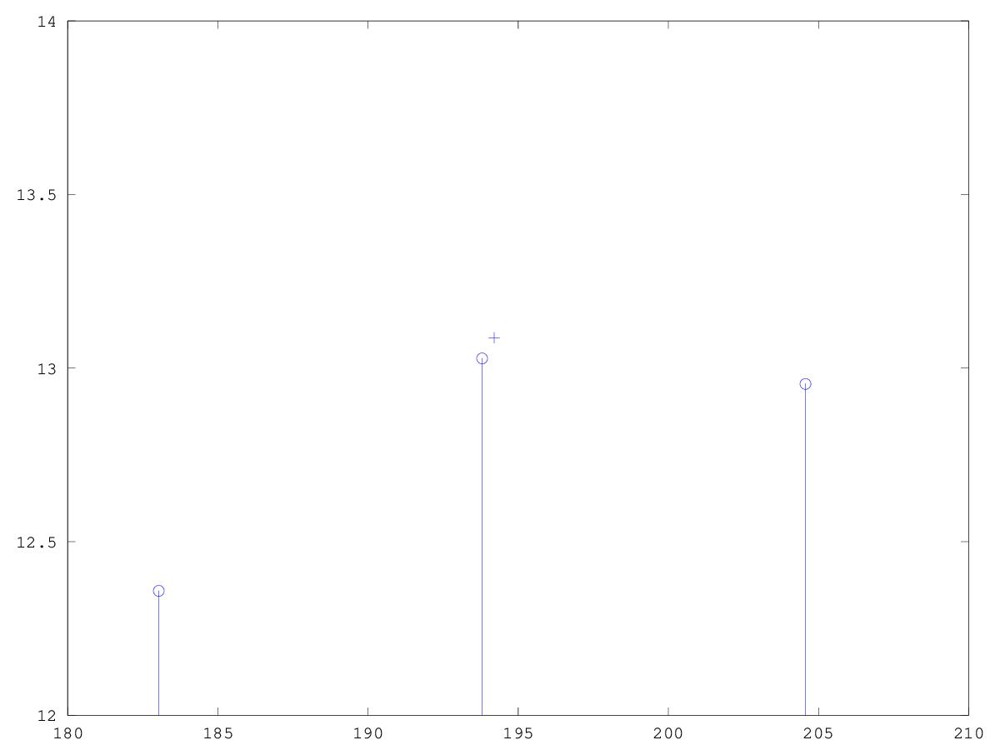

# CSEDSM 2 - Lezione del 7 febbraio 2019

## Argomenti

* Quantità d'informazione della STFT
* Feature extraction:
  * tracking delle parziali:
    * interpolazione parabolica - spiegare posizione picco
    * interpolazione parabolica - implementazione nella stft
    * le strutture dati in `octave`
    * tracking da una frame alla seguente

## Lavagne



## Codice `octave`

[funzione intparab()](./intparab.m)

```matlab
%Funzione che interpola 3 punti e ne restituisce magnitudine e frequenza del 
%picco massimo fra i 3 punti. 
%La funzione ritorna un array con mag e freq e riceve due array (per x e y)
%contenenti i valori dei 3 punti. 

function [freq, mag] = intparab(x,y)
  a = (y(1)+y(3)-(2*y(2)))/2;
  p = (y(1)-y(3))/(4*a);
  b = y(2)-(a*(p^2));
  
 xs = [-1:0.0001:1];  %Frequenza di campionamento molto fine per disegnare la parabola.
 ys = a*((xs-p).^2)+b;
% plot (xs, ys, [-1 0 1], y, "*")

  freq = x(2)+p;
  mag = b;  %a*(freq-p)^2+b; %Ricaviamo mag sostituendo freq a x. 
% plot (xs, ys, freq, mag, "*", x, y, "+")
  
endfunction
```

[script `Peak_P.m` con rilevamento interpolato dei picchi](./Peak_P.m)

```matlab
close all
clear all

[y, fs]=audioread("webern-op1-theme.wav");
dur=2;
y=y(1:fs*2,1);

winsize = 2^12; %4096
binsize = fs/winsize;
ssize = (2^10) - 1;
h = hanning(ssize); %Per ottenere lo zeropadding

zp = ceil((winsize - ssize)/2);  %Arrotondameto per eccesso.


overlap = 4;
hopsize = winsize/overlap;    %Hopsize di 1/4
rescale = 2/overlap;

nwin = round(((dur*fs))/(hopsize)); %Arrotondameto intelligente

fatrescale = 1/sum(h);  %Rescale sulla finestra di hanning. 
my_stft = zeros(winsize, nwin); %Matrice.

step = hopsize/fs;    %Convertiamo l'hopsize in durata.
t = [0:step:dur-step];  %Asse dei tempi.
f = [0:binsize:fs-binsize]; %Asse delle frequenze.

for k = 50:51  %Scelgo arbitrariamente una "fetta".
inizio = (k-1)*hopsize+1;
fine = (inizio+ssize)-1;
yh = y(inizio:fine).*h;     %Segnale finestrato.
fftbuffer = zeros(winsize, 1);
fftbuffer (zp:zp+ssize-1) = yh;
anal = fft(fftbuffer);             %Restituisce vettore di valori complessi.
my_stft(:,k) = anal;
end


mag = 20*log10(abs(my_stft(:,50))*fatrescale);

threshold = -40;  %Soglia di isolamento dei picchi. 
logic = (mag > threshold);  %Tutti i valori al di sotto di threshold sono posti in un vettore a 0.
%I valori al di sopra di threshold li pongo a 1. 
mag = ((mag - threshold) .* logic) + threshold; %Interpolo mag con logic.

freqs = []; %Array dinamico per frequenze.
mags = [];  %Array dinamico per magnitudini.
nfreq = 1;  %Indice per la scrittura all'interno di peak.

for k = 1:(length(mag)/2-3) %Dal primo campione a nyquist meno 3 campioni.
  m3 = mag(k:k+2);
  [m, mindex] = max(m3);
  
  if mindex == 2
    [freal, magreal] = intparab(f(k:k+2), m3);
    freqs(nfreq) = freal;
    mags(nfreq) = magreal;
    nfreq++;
  endif
  
endfor

hold on
stem (f, mag+40)
plot (freqs, mags+40, "+");
axis([0 600])
hold off
```

Questo codice produce il seguente grafico:



Ingrandendo la zona tra 180 e 210 Hz è possibile notare l'interpolazione del
picco:


