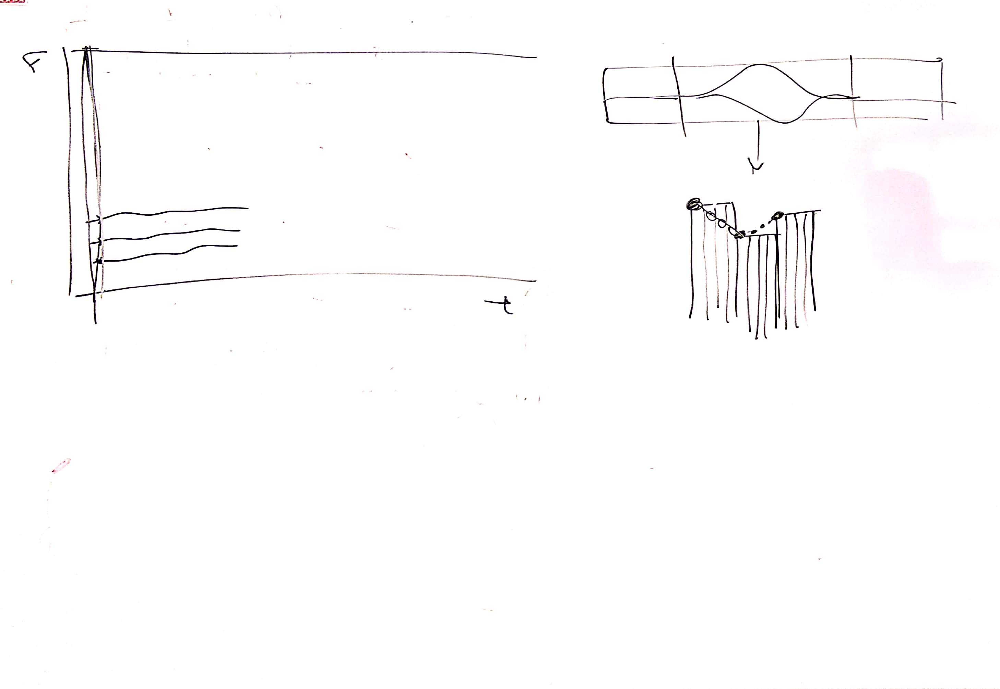

# CSEDSM 2 - Lezione del 21 febbraio 2019

## Argomenti

* Evoluzione dell'algoritmo per estrarre le parziali:
  * estrapolazione della funzione `peak_frame`
  * primo tracciamento grezzo delle parziali

## Lavagne



## Codice `octave`

[funzione intparab()](./intparab.m)

```matlab
%Funzione che interpola 3 punti e ne restituisce magnitudine e frequenza del 
%picco massimo fra i 3 punti. 
%La funzione ritorna un array con mag e freq e riceve due array (per x e y)
%contenenti i valori dei 3 punti. 

function [freq, mag] = intparab(x,y)
  a = (y(1)+y(3)-(2*y(2)))/2;
  p = (y(1)-y(3))/(4*a);
  b = y(2)-(a*(p^2));
  
 xs = [-1:0.0001:1];  %Frequenza di campionamento molto fine per disegnare la parabola.
 ys = a*((xs-p).^2)+b;
% plot (xs, ys, [-1 0 1], y, "*")

  freq = x(2)+p;
  mag = b;  %a*(freq-p)^2+b; %Ricaviamo mag sostituendo freq a x. 
% plot (xs, ys, freq, mag, "*", x, y, "+")
  
endfunction
```

[funzione peak_frame()](./peak_frame.m)
```matlab
%Funzione che ritorna due array per righe, uno con frequenze l'altro con magnitudine.

function [freqs, mags] = peak_frame (sig, fcamp, window, fftsize, threshold)
 
 fatrescale = 1/sum(window);  %Rescale sulla finestra di hanning. 
 zp = ceil((fftsize - length(window))/2);  %Arrotondameto per eccesso.
 sigh = sig.*window;     %Segnale finestrato.
 fftbuffer = zeros(fftsize, 1);
 fftbuffer (zp:zp+length(window)-1) = sigh;
 anal = fft(fftbuffer);   %Restituisce vettore di valori complessi.
 binsize = fcamp/fftsize;
 f = [0:binsize:fcamp-binsize]; %Asse delle frequenze.
 mag = 20*log10(abs(anal)*fatrescale);

 
 logic = (mag > threshold);  %Tutti i valori al di sotto di threshold sono posti in un vettore a 0.
 %I valori al di sopra di threshold li pongo a 1. 
 mag = ((mag - threshold) .* logic) + threshold; %Interpolo mag con logic.
 
 freqs = zeros(fftsize, 1); %Array per frequenze.
 mags = zeros(fftsize, 1);  %Array per magnitudini.

 for k = 1:(length(mag)/2-3) %Dal primo campione a nyquist meno 3 campioni.
   m3 = mag(k:k+2);
   [m, mindex] = max(m3);
   
   if mindex == 2
     [freal, magreal] = intparab(f(k:k+2), m3);
     freqs(k) = freal;
     mags(k) = magreal;
   endif
   
 endfor
 
endfunction
```

[script `Peak_P.m` con rilevamento interpolato dei picchi](./Peak_P.m)

```matlab
close all
clear all

[y, fs]=audioread("webern-op1-theme.wav");
dur=2;
y=y(1:fs*2,1);

winsize = 2^12; %4096
binsize = fs/winsize;
ssize = (2^10) - 1;
h = hanning(ssize); %Per ottenere lo zeropadding

overlap = 4;
hopsize = winsize/overlap;    %Hopsize di 1/4

nwin = round(((dur*fs))/(hopsize)); %Arrotondameto intelligente

fatrescale = 1/sum(h);  %Rescale sulla finestra di hanning. 
my_freqs = zeros(winsize, nwin); %Matrice.
my_mags = zeros(winsize, nwin);

step = hopsize/fs;    %Convertiamo l'hopsize in durata.
t = [0:step:dur-step];  %Asse dei tempi.

threshold = -40;  %Soglia di isolamento dei picchi.

for k = 1:nwin
 inizio = (k-1)*hopsize+1;
 fine = (inizio+ssize)-1;
 yf = y(inizio:fine);     %Segnale affettato.
 [my_freqs(:,k), my_mags(:,k)] = peak_frame(yf,fs,h,winsize,threshold);
end

f = [0:binsize:fs-binsize]; %Asse delle frequenze.
 

plot (t, my_freqs, "+");
```

Questo codice produce il seguente grafico:


