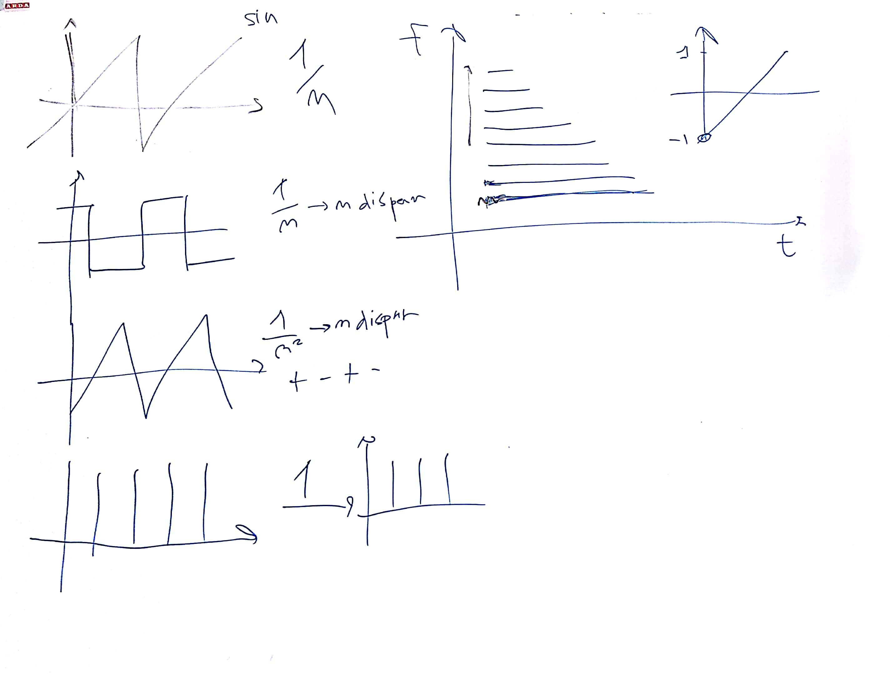

# IM 3 - Lezione del 15 novembre 2018

## Argomenti

* Introduzione al corso
  * prerequisiti
  * obiettivi (informatica *musicale*, con enfasi sulla parola *musicale*)
* Introduzione agli strumenti del corso
  * specificità degli strumenti
    * *csound*: semplicità concettuale, necessità di back-end di programmazione
    * *SuperCollider*: nuova generazione
    * *Pure Data*: prototipazione di strumenti
    * *Octave*: flessibilità analitica
* Ricapitolazione delle tecniche di sintesi:
  * la sintesi additiva:
    * principi di elaborazione
    * forme d'onda sintetiche

## Lavagne

## Compiti a casa

1. Realizzare in `octave` la sintesi delle seguenti forme d'onda sintetiche:
   * *dente di sega*
   * *quadra*
   * *triangolare*
   * *treno d'impulsi*
2. Progettare una struttura sonora da realizzare esclusivamente con sinusoidi inviluppate, immaginando una possibile strategia di realizzazione
