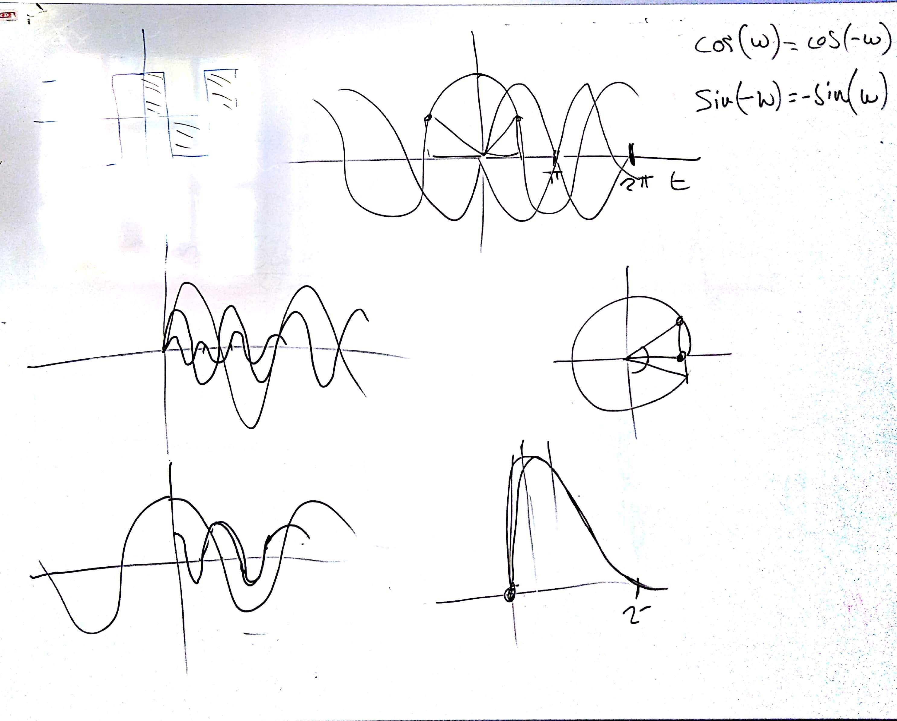
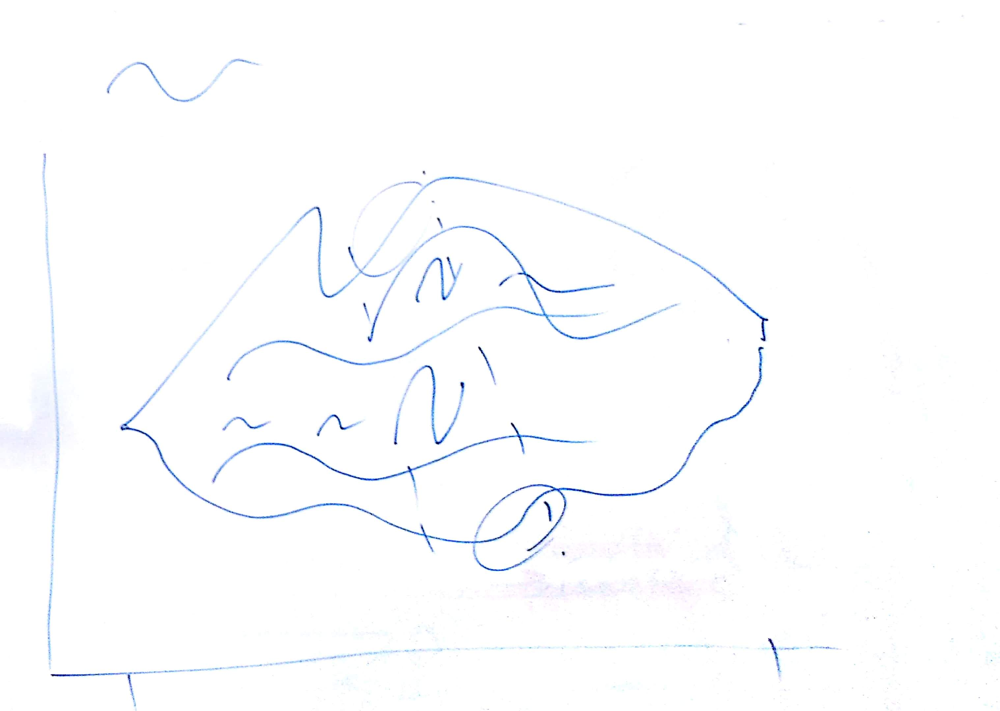

# IM 3 - Lezione del 29 novembre 2018

## Argomenti

* importanza della fase nella realizzazione delle forme d'onda sintetiche
* differenza tra spettro dell'impulso perfetto e spettro del rumore bianco
* ascolto di *Progetto II* di Fausto Razzi
* discussione della realizzazione dei progetto di *nuvola sonora* specificato
  come da seconda immagine della lavagna

## Lavagne

## Compiti a casa

1. Realizzare in `octave` la sintesi delle seguenti forme d'onda sintetiche:
   * *dente di sega*
   * *quadra*
   * *triangolare*
   * *treno d'impulsi* 
   in forma *cosinusoidale* (cioè simmetrica intorno allo zero) anziché
   *sinusoidale* (cioè asimmetrica intorno allo zero)
2. Realizzazione pratica dell'esempio della lavagna 2 con sinusoidi
   inviluppate
