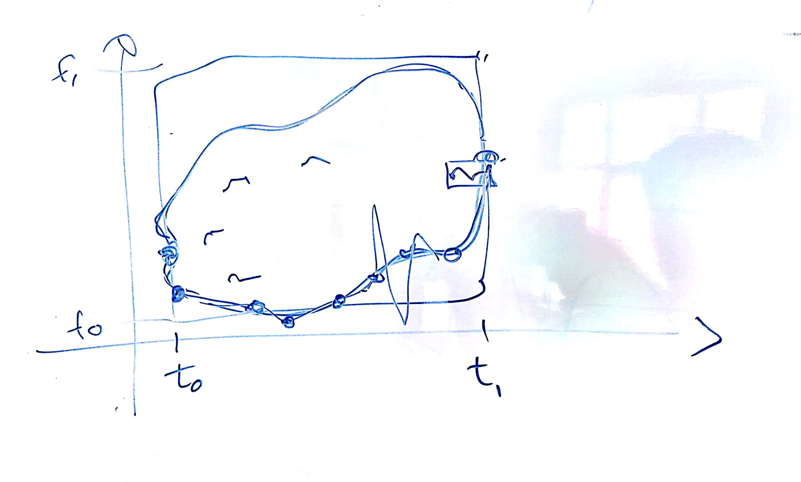
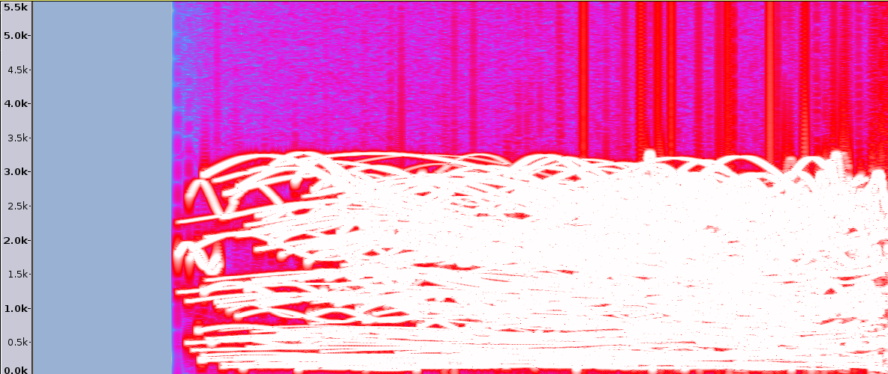

# IM 3 - Lezione del 13 dicembre 2018

## Argomenti

* realizzazione della *nuvola* con `csound`
  * integrazione di `csound` con `ruby`
  * realizzazione di una partitura casuale (limitata in un rettangolo)
  * realizzazione delle funzioni polinomiali
* utilizzo del comando `make` nei progetti

## Lavagne



## Codice

[orchestra per il frammento *amadio*](./amadio.orc)

```csound
sr = 44100
ksmps = 32
nchnls = 1
0dbfs = 1
/*Apertura dello strumento numero 1.*/
instr 1
iamp = p4
idur = p3
/**/
ifreq = p5
kmod oscil1 0, ifreq/10, idur, 1
kfreq = ifreq+kmod
aout oscil iamp, kfreq, 1

/*Creiamo un inviluppo per "pulire" il segnale*/

islope = idur/100
aout linen aout, islope, idur, islope
out aout
endin
```

[ruby script per il frammento *amadio*](./amadio.rb)

```ruby
#creazione nuvola

T = [1, 6]			#asse tempo
F = [100, 3000]		#asse frequenze
N = 500				#n elementi nuvola
mindur = 0.005
maxAmp = 25.0/N 
minAmp = maxAmp/100.0

#generiamo elementi tramite loop

puts "f1	0	4096	10	1"

1.upto(N) do | n|					#metodo upto: da 1 fino a n esegui loop
	at = rand()*(T[1]-T[0]) + T[0]	#action time (attacco)	
									#T[1]=6 T[0]=1 => rand tra 0 e 5

	dur = rand()*(T[1]-at - mindur)+ mindur			#calcolo durata
	amp = rand()*(maxAmp - minAmp) + minAmp			#calcolo ampiezza
	freq = rand()*(F[1] - F[0]) + F[0]				#calcolo frequenza
	puts "i1 #{at} #{dur} #{amp} #{freq}"
end


#per dare la forma che vogliamo abbiamo bisogno di funzione
#polinomiali di grado variabile
```

[Makefile per il comando `make`](./Makefile)

```make
#make
#
#

test.wav: amadio.sco
	csound amadio.orc amadio.sco

amadio.sco : amadio.rb
	ruby amadio.rb > amadio.sco
```

Spettrogramma del risultato:


