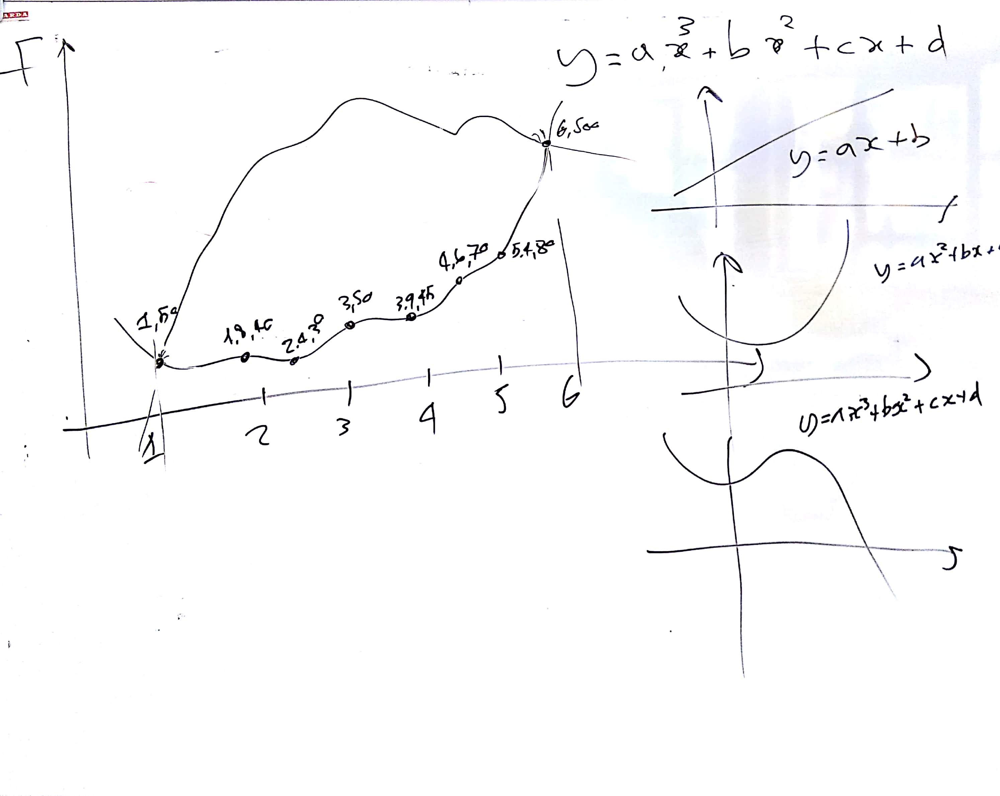
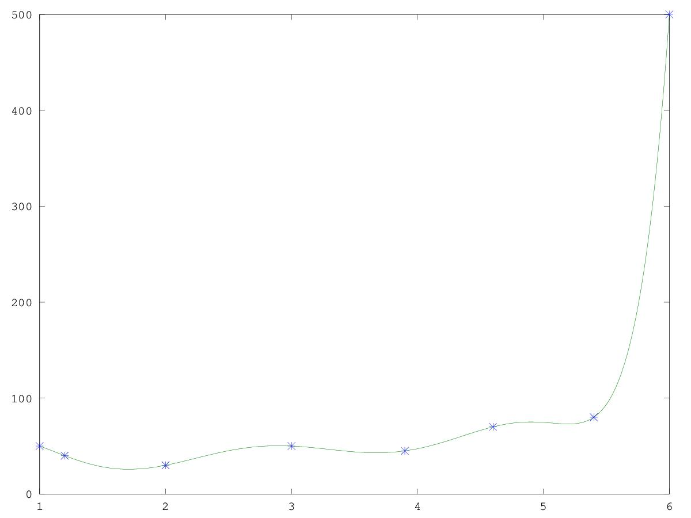

# IM 3 - Lezione del 20 dicembre 2018

## Argomenti

* realizzazione della *nuvola* con `csound`
  * realizzazione della funzione polinomiale inferiore per il contorno

## Lavagne



## Codice octave

```matlab
x=[1 1.2 2 3 3.9 4.6 5.4 6];
y=[50 40 30 50 45 70 80 500];
p=(polyfit(x, y, length(x)));
X=[x(1):0.01:x(end)];
g=length(x);
Y=polyval(p, X);
plot(x, y, "*",X,Y)
```

Questo programma produce il seguente grafico:



## Compiti per le vacanze

* elucubrazione di nuove forme, meta partiture, ecc.
