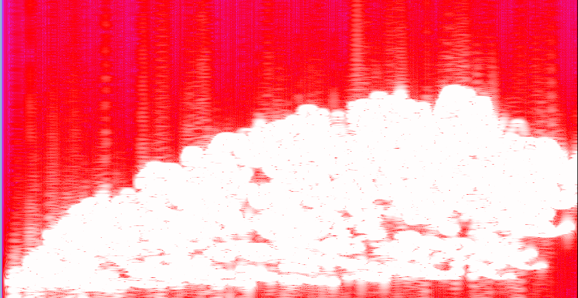

# IM 3 - Lezione del 7 feb 2019

## Argomenti

* realizzazione della *nuvola* con `csound`
  * completamento e debug della funzione `lookup`
* *scalamento* della nuvola a *composizione di nuvole*

## Codice `octave`

[funzione `matlab` che genera i polinomi inferiore e superiore](./im3_poly.m)

```matlab
%Creazione della parte inferiore del "contenitore".
xlo = [1 1.2 2 3 3.9 4.6 5.4 6];
ylo = [50 40 30 50 45 70 80 500]*2;
plo = (polyfit(xlo, ylo, length(xlo)));
X = [xlo(1):0.01:xlo(end)];
Ylo = polyval(plo, X);


%Creazione della parte superiore del "contenitore". 
xhi = xlo; %Per comodità usiamo le stesse x.
yhi = [50 150 400 550 650 700 650 500]*2;
phi = (polyfit(xhi, yhi, length(xhi)));
Yhi = polyval(phi, X);

plot (X, Ylo, X, Yhi, xlo, ylo, "*", xhi, yhi, "*")

%Stampa del file da leggere con Ruby, quindi utilizziamo la sua sintassi.
fh = fopen("tables.rb", "w");  %Generazione del file di Ruby e apertura in scrittura. 
fprintf (fh, "T = ["); %Inizio da stampare dell'array dopo il quale vanno scritti i valori.
for k=1:length(X)
fprintf (fh, "%.2f, ", X(k));
endfor
fprintf (fh, "]\n");   %Fine dell'array. 

fprintf (fh, "F = [");
for k=1:length(X)
fprintf (fh, "[%.2f, %.2f], ", Ylo(k), Yhi(k));
endfor
fprintf (fh, "]\n");
fclose (fh); 
```

## Codice `ruby`

[`amadio.rb` - generatore di partitura per una nuvola singola](./amadio.rb)

```ruby
#creazione nuvola
$:<< "."			#Formula maggica: aggiungi all'array delle posizioni dei file la directory corrente.
require "tables"	#Richiamo il file scritto con Octave.

#Definiamo una funzione di lookup.
# FIXME: questa funzione non è corretta
def lookup(time)	#Restituisce le frequenze relative a time.
	t = ((time*100).round/100.0) - T[0]	#time viene arrotondato al centesimo.
	F[t*100]		#Valore restituito dalla funzione.
end

N = 500				#n elementi nuvola
mindur = 0.005
maxdur = 0.5
maxAmp = 36.0/N
minAmp = maxAmp/100 

#generiamo elementi tramite loop

puts "f1	0	4096	10	1"

1.upto(N) do | n|					#metodo upto: da 1 fino a n esegui loop
	at = rand()*(T[-1]-T[0]) + T[0]	#action time (attacco)	
									#T[1]=6 T[0]=1 => rand tra 0 e 5

	dur = rand()*(maxdur-mindur)+ mindur			#calcolo durata
	amp = rand()*(maxAmp - minAmp) + minAmp			#calcolo ampiezza
	(fmin, fmax) = lookup(at)
	freq = rand()*(fmax - fmin) + fmin				#calcolo frequenza
	puts "i1 #{at} #{dur} #{amp} #{freq}"
end


#per dare la forma che vogliamo abbiamo bisogno di funzione
#polinomiali di grado variabile
```

Questo codice produce la partitura di `csound` che serve a realizzare la
*nuvola* richiesta dal compositore. Lo spettrogramma della *nuvola* realizzata
è:



Per lo scalamento a *composizione di nuvole* abbiamo iniziato scrivendo un
[oggetto `Nuvola`](./nuvola.rb) in `ruby`:

```ruby
#@ = variabili interne
require "tables"	#Richiamo il file scritto con Octave.
class Nuvola
	MAXDUR = 0.5
	MINDUR = 0.005
	def initialize(line)
		#line.split splitta in 5 campi
		(@at,@dur,@minfreq,@deltafreq,@amp,@n) = line.split(/\s+/)
	end

	def lookup(time)	#Restituisce le frequenze relative a time.
		t = ((time*100).round/100.0) - T[0]	#time viene arrotondato al centesimo.
		F[t*100]		#Valore restituito dalla funzione.
	end
	def to_csound()
		#------variabili-------------
		rit = ""			#variabile di ritorno
		tstart = @at 		#tempo
		tend = @at + @dur

		#-----------------------------	
		1.upto(@n) do 		#metodo upto: da 1 fino a @n
			at = rand()*(tend - tstart) + tstart	#action time (attacco)	
										#T[1]=6 T[0]=1 => rand tra 0 e 5

			dur = rand()*(MAXDUR-MINDUR)+ MINDUR			#calcolo durata
			#SIAMO ARRIVATI QUI
			(fmin, fmax) = lookup(at)
			freq = rand()*(fmax - fmin) + fmin				#calcolo frequenza
			amp = rand()*(maxAmp - minAmp) + minAmp			#calcolo ampiezza
			puts "i1 #{at} #{dur} #{amp} #{freq}"
		end
		return rit
	end
end
```

Tale oggetto e il suo relativo test di regressione andranno completati nelle
prossime lezioni.

## Codice `csound`

[orchestra csound](./amadio.orc)

```csound
sr = 44100
ksmps = 32
nchnls = 1
0dbfs = 1
/*Apertura dello strumento numero 1.*/
instr 1
iamp = p4
idur = p3
/**/
ifreq = p5
kmod oscil1 0, ifreq/10, idur, 1
kfreq = ifreq+kmod
aout oscil iamp, kfreq, 1

/*Creiamo un inviluppo per "pulire" il segnale*/

islope = idur/100
aout linen aout, islope, idur, islope
out aout
endin
```

## Codice `make`

Tutta la filiera della generazione è gestita dal software di gestione `make`
che si avvale del [`Makefile` che segue](./Makefile):

```Makefile
#make
#
#

test.wav: amadio.sco
	csound amadio.orc amadio.sco

amadio.sco : amadio.rb
	ruby amadio.rb > amadio.sco
```

## Compiti

* elaborazione di una metapartitura per una *composizione di nuvole*
